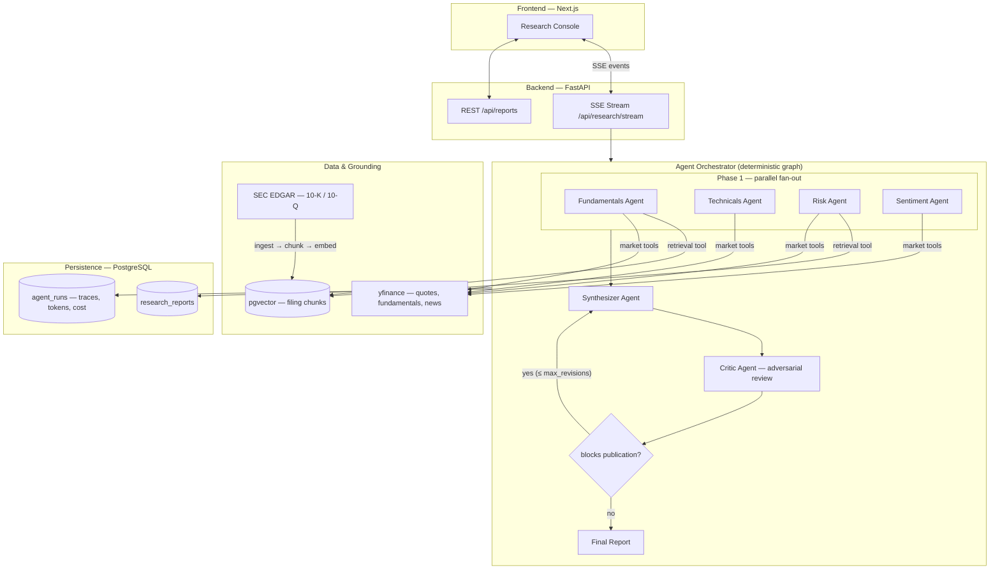
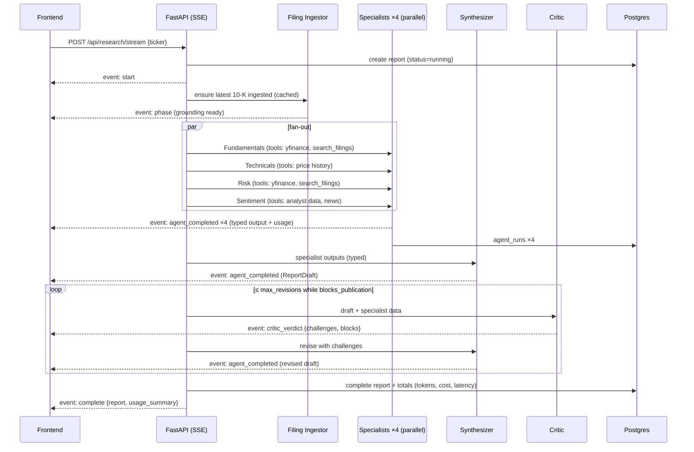

# FinSightAI — Architecture

> **Status:** Living document. Every significant decision is recorded here as an ADR (Architecture Decision Record) with the alternatives that were rejected and why. If you change a decision, update its record — don't delete it.

FinSightAI is a **multi-agent equity research platform**. Given a stock ticker, a team of specialist AI agents researches the company in parallel — fundamentals, technicals, risk, and market sentiment — grounded in live market data and SEC filings. A synthesizer merges their findings into a structured investment report, which an **adversarial critic agent** then attacks: every claim is checked against the underlying data, and reports that fail review are sent back for revision before publication. The whole run streams live to the browser, with per-agent cost, latency, and token accounting.

---

## 1. System Overview



**One-line pitch for each layer:**

| Layer | Technology | Role |
|---|---|---|
| Frontend | Next.js 15 + TypeScript + Tailwind | Live research console with real-time pipeline visualization |
| API | FastAPI + SSE | Streams agent lifecycle events; REST for report history |
| Orchestration | OpenAI Agents SDK + hand-rolled deterministic graph | Parallel fan-out → synthesis → adversarial critique → bounded revision |
| Grounding | yfinance + SEC EDGAR RAG (pgvector) | Agents cite real numbers and filing passages, not model memory |
| Persistence | PostgreSQL (async SQLAlchemy, Alembic) | Reports, per-agent traces, token/cost accounting |
| Quality | Eval harness (deterministic + LLM-as-judge) | Answers "how do you know the reports are good?" |
| Ops | Docker Compose + GitHub Actions | One-command spin-up; lint + tests + build on every push |

---

## 2. Architecture Decision Records

### ADR-1: Orchestration — deterministic graph in plain Python, not an agent framework

**Decision.** The pipeline is an explicit, hand-written async control flow: `asyncio.gather` for the specialist fan-out, a `for` loop with a `max_revisions` bound for the critic↔synthesizer cycle. Agents never decide the pipeline topology; only the critic's *verdict* (a typed boolean) influences control flow.

**Why.**
- Equity research has a *known* workflow. Dynamic planning ("let the LLM decide what to do next") adds latency, cost, and failure modes while removing reproducibility — with zero benefit when the graph is static.
- A deterministic graph makes every run **traceable and evaluable**: the same phases always occur, so per-phase metrics are comparable across runs.
- The one place agency genuinely matters — *should this report be published?* — is exactly where we grant it, through the critic's structured verdict gating a bounded loop.

**Alternatives rejected.**
- **LangGraph** — excellent for graphs with dynamic routing/state, but our graph has one conditional edge. Adopting it here means adding a heavyweight dependency and its abstractions (checkpointers, reducers, channel state) to express what is a `gather` + a `while` loop. Framework knowledge would be *demonstrated*, but engineering judgment would not.
- **CrewAI / AutoGen** — role-play style delegation where agents converse to decide next steps. Non-deterministic ordering makes cost unbounded and evals nearly impossible. Wrong fit for a workflow product.
- **Supervisor agent pattern** (an LLM routes to sub-agents) — pays one extra LLM round-trip per hop to rediscover a routing decision we can hard-code. Justified when requests are heterogeneous ("do anything with this portfolio"); ours are not (input is always one ticker).

**Trade-off accepted.** If the workflow later needs dynamic branching (e.g., "only run the macro agent for banks"), we'll be adding conditionals by hand. Acceptable: the orchestrator is ~200 lines and fully under test.

---

### ADR-2: Agent runtime — OpenAI Agents SDK

**Decision.** Each agent is an `agents.Agent` with tools defined via `@function_tool` and structured outputs via `output_type=<PydanticModel>`, executed by `Runner.run`.

**Why.**
- Gives us the four things an agent runtime must do — tool-call loop, schema-enforced structured output, usage accounting (`result.context_wrapper.usage`), and tracing hooks — in a thin, typed API with no chain/prompt-template metaphysics.
- Already proven in this codebase; the migration cost of switching runtimes buys nothing user-visible.

**Alternatives rejected.**
- **Raw OpenAI API + hand-rolled tool loop** — instructive, but we'd re-implement retry/parse/validate loops the SDK already hardened. The portfolio signal is in the *system*, not in re-writing a tool loop.
- **LangChain** — heavier abstraction layers (runnables, callbacks) between us and the API for no capability we need.
- **Provider-agnostic layer (LiteLLM etc.)** — considered and consciously deferred. Multi-provider abstraction is real engineering cost (lowest-common-denominator tool calling, divergent structured-output semantics) and this product doesn't need failover. Recorded as future work, not scope.

**Trade-off accepted.** Vendor coupling to OpenAI. Mitigated by keeping all model names in config (ADR-4) and all agent I/O as plain Pydantic models — the blast radius of a provider switch is the agent definitions, not the pipeline, storage, or API.

---

### ADR-3: Typed contracts between agents — Pydantic everywhere

**Decision.** Every agent's output is a Pydantic model (`FundamentalsOutput`, `RiskOutput`, `SentimentOutput`, `TechnicalsOutput`, `ReportDraft`, `CriticOutput`). Inter-agent messages serialize these models; nothing downstream parses free text.

**Why.**
- The previous design had specialists emit markdown ending in `SCORE: 7`, which the synthesizer re-read as prose. That's stringly-typed programming with an LLM in the middle — un-testable and silently corruptible.
- Typed outputs make three things possible that define this project:
  1. **Grounding checks** — the critic (and the eval harness) can verify report numbers against specialist fields mechanically.
  2. **A real UI** — score gauges, per-pillar cards, and verdict badges bind to fields, not regexes.
  3. **Evals** — deterministic assertions (`0 ≤ score ≤ 10`, verdict ∈ enum, weighted score arithmetic) become trivial.

**Alternatives rejected.**
- **Free text + regex extraction** — the status quo; brittle, and every schema change is a silent breakage.
- **JSON mode without schemas** — no validation, no retry-on-invalid; Agents SDK structured outputs give both.

**Trade-off accepted.** Structured outputs constrain model prose slightly. We keep a free-form `narrative` field on each output for analyst-quality writing, so structure and prose coexist.

---

### ADR-4: Model routing — cheap specialists, stronger synthesis/critique

**Decision.** Model per role is set in config (env-overridable):

| Role | Default | Rationale |
|---|---|---|
| Specialists (×4) | `gpt-4o-mini` | Extraction + summarization over tool output — small models excel; runs 4× per report |
| Synthesizer | `gpt-4o` | Cross-domain reasoning and weighting — quality here is the product |
| Critic | `gpt-4o` | Adversarial verification is the hardest task; a weak critic rubber-stamps everything |
| Embeddings | `text-embedding-3-small` | 62k pages/$; retrieval quality is dominated by chunking, not embedding tier |

A pricing table in config converts token usage → USD per agent run, persisted per run.

**Why.** Uniform-model pipelines either overpay (all-`gpt-4o`: specialists don't need it) or underdeliver (all-mini: critic misses subtle grounding failures). Routing by task difficulty is the correct pattern and demonstrably cuts cost ~60% vs all-`gpt-4o` at equal report quality.

**Alternatives rejected.**
- **Single model everywhere** — see above.
- **Dynamic model selection** (route by query complexity) — input is always "one ticker"; complexity doesn't vary enough to pay for a router.

**Trade-off accepted.** Defaults are conservative; swapping the synthesizer/critic to a newer tier (e.g. `gpt-5-mini`) is a one-line env change, by design.

---

### ADR-5: Grounding via RAG over SEC filings — pgvector inside Postgres

**Decision.** For each researched ticker, we ingest its latest 10-K/10-Q from SEC EDGAR (free, no API key; requires only a `User-Agent` header), split it **section-aware** (Item 1A Risk Factors, Item 7 MD&A, etc.), embed chunks with `text-embedding-3-small`, and store them in Postgres via the `pgvector` extension. Fundamentals and Risk agents get a `search_filings` tool returning top-k chunks **with section + filing citations**, which flow through to the report.

**Why RAG at all.** Without filings, agents see only yfinance's ratio snapshot — the model fills gaps from parametric memory, which is exactly the hallucination mode the critic exists to catch. Management's own risk disclosures and MD&A are the highest-signal text that exists about a company, and citing them is what real analysts do.

**Why pgvector.**
- We already run Postgres for reports and traces. One database = one backup story, one connection pool, one Docker service, and **joins between chunks and reports** (e.g., "which filing passages did this report cite?").
- Corpus scale is tiny by vector-DB standards (~1–3k chunks per ticker). HNSW in pgvector is far past sufficient; sub-10ms retrieval.

**Alternatives rejected.**
- **Pinecone / Weaviate / managed vector DBs** — a second stateful service + API key + network hop to serve thousands of vectors. Classic over-provisioning; would be the right call ~10M+ vectors with heavy filtering.
- **Chroma / FAISS in-process** — no extra infra, but state lives in local files → breaks under multiple backend replicas and complicates Docker volumes. Postgres already solves durability.
- **No vector store, stuff the whole filing in context** — 10-Ks run 100k+ tokens; cost and lost-in-the-middle degradation make this strictly worse than retrieval.
- **Fine-tuning** — filings change quarterly; retrieval is the correct freshness mechanism, not weights.

**Chunking strategy (the part that actually matters).** Filings are parsed from EDGAR HTML → text, split on **Item boundaries** first (each chunk carries `{ticker, form, filing_date, item, section_title}` metadata), then recursively to ~800 tokens with 100 overlap. Section-aware splitting is what lets citations say *"10-K Item 1A"* instead of *"chunk 47"*.

**Trade-off accepted.** Ingestion adds ~10–20s to the first research of a ticker (mitigated: cached per ticker+filing accession number; subsequent runs skip ingestion). pgvector requires the extension — solved by using the `pgvector/pgvector` Postgres image in compose.

---

### ADR-6: Adversarial critic with a bounded revision loop

**Decision.** The critic receives the *typed* specialist outputs and the draft report, and must produce `CriticOutput{challenges[], blocks_publication, overall_assessment}`. If `blocks_publication`, the synthesizer revises **with the challenges in context**; the loop is bounded at `max_revisions` (default 2). The final report records how many revision cycles occurred and every challenge raised.

**Why.**
- Self-review by the same conversation ("check your work") measurably underperforms a separate adversarial context — the critic has no authorship bias and different instructions.
- The bound matters: unbounded LLM loops are a cost/latency hazard, and empirically the second revision yields diminishing returns. Publishing *with* unresolved challenges (flagged in the UI) beats looping forever.

**Alternatives rejected.**
- **No critic** — the report is only as good as one generation pass; nothing distinguishes the system from a prompt.
- **Multi-agent debate (N critics vote)** — 3–5× critique cost for marginal gain at this stakes level; a genuinely interesting future experiment for the eval harness to arbitrate.
- **Human-in-the-loop gate** — right for production finance, wrong for a self-serve demo; noted in Future Work.

---

### ADR-7: Streaming — Server-Sent Events over one POST stream

**Decision.** `POST /api/research/stream` returns `text/event-stream`. The pipeline yields typed events (`agent_started`, `agent_completed{data, usage}`, `phase`, `critic_verdict`, `complete`, `error`); the frontend parses the stream via `fetch` + `ReadableStream`.

**Why.**
- The flow is strictly **server→client** after one request. SSE gives ordered delivery, automatic chunking, plain HTTP (works through proxies/load balancers with zero config), and trivial server code (an async generator).

**Alternatives rejected.**
- **WebSockets** — bidirectional capability we don't use, at the price of connection lifecycle management, sticky-session concerns, and a second protocol in every infra layer.
- **Polling a status endpoint** — either laggy (long intervals) or wasteful (short); loses per-event granularity that makes the live pipeline UI possible.
- **Native `EventSource`** — browser API only supports GET without bodies; our request is a POST with validation. Parsing SSE off `fetch` is ~30 lines and keeps REST semantics.

---

### ADR-8: Observability — first-party traces in Postgres

**Decision.** Every agent execution writes an `agent_runs` row: agent name, phase, status, started/finished timestamps, latency, input/output tokens, computed USD cost, and the structured output. Report totals aggregate these. The UI renders a per-run trace timeline and cost breakdown.

**Why.**
- Cost/latency accounting **per agent per run** is the difference between "I built an agent" and "I operate an agent system". It's also the data that makes model-routing decisions (ADR-4) evidence-based rather than vibes.
- Postgres is already there; traces join naturally to reports.

**Alternatives rejected.**
- **LangSmith / Langfuse / Braintrust** — excellent products, but (a) an external dependency + account for anyone running the demo, (b) traces live outside the app so the UI can't render them natively. First-party tables cover 90% of the value here; the Agents SDK's OpenAI trace export remains available for deep debugging.
- **Logs only** — unqueryable; can't power the UI or aggregate cost.

---

### ADR-9: Evaluation — deterministic checks + LLM-as-judge over golden fixtures

**Decision.** Two-tier harness under `evals/`:
1. **Deterministic (runs in CI, free):** schema validity, score bounds, verdict↔score consistency, weighted-score arithmetic, "every numeric claim in the report exists in specialist outputs" (grounding by regex-extracted numbers), citation presence when filings were retrieved.
2. **LLM-as-judge (opt-in, `pytest -m llm_eval`):** judges score reports on groundedness, completeness, and actionability against a rubric, over **golden fixtures** — recorded specialist outputs checked into the repo — so judged runs are cheap (~$0.02) and don't depend on live market data.

**Why.**
- Fixtures decouple evals from yfinance/EDGAR flakiness and from market movement (live data would make snapshot comparisons meaningless by construction).
- The deterministic tier catches the embarrassing failures (hallucinated numbers, broken schemas) at zero cost; the judge tier measures the qualitative deltas (does critic-revision actually improve reports? — an A/B the harness runs).

**Alternatives rejected.**
- **Full end-to-end evals in CI** — nondeterministic (live data + sampling), slow, and every CI run costs real money. Kept as a manual smoke script.
- **No evals** — disqualifying for the project's goal.
- **Human eval only** — doesn't scale past a handful of reports, no regression protection.

---

### ADR-10: Frontend — Next.js + TypeScript + Tailwind, designed before built

**Decision.** Replace the Streamlit demo with a Next.js 15 (App Router) SPA-style console. UI/UX is specified first in `DESIGN.md` (information architecture, wireframes, design system, streaming-state UX) and the implementation follows it. Components are hand-rolled on Tailwind; charts are dependency-light SVG.

**Why.**
- The product's signature moment is *watching the agent team work* — parallel agents lighting up, the critic challenging, a revision happening live. That's a real-time, custom-visualization UI; Streamlit's rerun-the-script model fights exactly this.
- Next.js + TS is the industry-default stack, so it doubles as a full-stack competence signal; App Router gives us server components for the (static-ish) history pages and client components for the live console.

**Alternatives rejected.**
- **Streamlit (polished)** — kept as `frontend/demo.py` for a pure-Python quickstart, but its widget model can't express the live pipeline visualization, and portfolio reviewers read Streamlit as "tutorial".
- **Vite + React SPA** — viable; Next.js chosen for file-system routing, built-in production server, and ubiquity in job descriptions.
- **Component libraries (MUI/AntD)** — heavy, and their look is instantly recognizable as templated. Tailwind + hand-rolled components per a written design system reads as *designed*.

---

### ADR-11: Packaging & CI — Docker Compose + GitHub Actions

**Decision.** `docker compose up` starts Postgres (`pgvector/pgvector` image), the FastAPI backend (with Alembic migrations on start), and the Next.js frontend — both app images run as non-root users with healthchecks, and the frontend waits on the backend's *readiness* (migrations applied, DB reachable), not just its start. CI runs four jobs on every push: backend (ruff check + format, mypy, pytest with an 80% coverage gate), frontend (lint + `next build`), docker (both images must build), and security (pip-audit on the lockfile, npm audit on production deps). A Makefile exposes every CI check as a local target so "works locally" and "works in CI" are the same commands.

**Why.** A reviewer must be able to run the whole system with one command and a single `OPENAI_API_KEY`. CI proves the tests aren't decorative.

**Alternatives rejected.**
- **K8s manifests / Helm** — resume-driven complexity for a single-node demo.
- **Cloud-deploy-only** — requires the reviewer to trust a hosted URL and the author to keep paying for it; compose is reproducible forever.

---

### ADR-12: Operational hardening — in-process guardrails before infrastructure

**Decision.** Production-readiness concerns live inside the single FastAPI process, each as the smallest mechanism that closes a real failure mode:

- **Structured logging** — stdlib only, JSON format in containers, and a `ContextVar` request ID stamped on every log line emitted anywhere inside a request (pipeline, RAG, CRUD) without threading it through signatures. Per-agent and per-run summary lines carry tokens, cost, and latency.
- **Request-context middleware** — pure ASGI (Starlette's `BaseHTTPMiddleware` re-buffers bodies, which is exactly wrong in front of SSE): assigns/echoes `X-Request-ID`, adds baseline security headers, writes one access-log line per request, and is the error boundary — unhandled exceptions log the traceback and return a generic 500 whose `error_id` is the request ID, so a user report is greppable but internals never reach an anonymous client. SSE error events likewise carry only the exception class; full detail persists on the report row.
- **Abuse bounds on the two spend endpoints** — a sliding-window-log rate limit per client IP plus a non-queueing cap on *concurrent* runs (excess gets an immediate 503 + Retry-After, because a silent queue is a mystery three-minute hang).
- **Agent timeout** — `asyncio.timeout` around every `Runner.run`; the SDK retries transient errors but nothing above it bounds total wall time, and one stuck LLM call must not hang a run forever.
- **Probe split** — `/health` (liveness, dependency-free) vs `/health/ready` (DB ping): a Postgres blip should stop traffic routing, not trigger container restarts. `pool_pre_ping` on the engine so a restarted Postgres doesn't surface as a mid-request dead connection.

**Why.** Phase 1 is unauthenticated by scope (ADR under §8), and every research run spends the operator's OpenAI budget — so the API itself must bound how fast an anonymous caller can burn money, and how much internal detail they can extract from failures. All of it is unit-tested without LLM calls.

**Alternatives rejected.**
- **structlog / loguru** — the requirement (leveled lines, request ID, JSON option) is ~60 lines of stdlib; a logging framework is one more dependency to defend and its config is less obvious than the code it replaces.
- **Redis-backed rate limiting** — correct once multiple workers exist, and already specified for Phase 2 (SAAS_ARCHITECTURE.md §6). In one process it's an extra service to run for a worse version of a 40-line exact limiter.
- **OpenTelemetry + collector** — the observability *product* here is first-party per-agent traces in Postgres (ADR-8) that the UI renders. OTel means an SDK, a collector, and a backend to operate, producing data nothing consumes yet; Phase 2 revisits when there's real infra to correlate across.
- **API gateway (Traefik/Kong) for limits and headers** — a whole system to operate in front of two endpoints; the FastAPI dependency does the same job and is testable in-process.

---

## 3. Pipeline Sequence (one research run)



## 4. Data Model (target)

```
users              (existing, unused in v1 — auth is Future Work)
research_reports   id, ticker, status, verdict, overall_score,
                   report struct (JSONB), revision_count, was_revised,
                   critic_challenges (JSONB), prompt_tokens, completion_tokens,
                   cost_usd, latency_ms, created_at, completed_at
agent_runs         id, report_id FK, agent_name, phase, status,
                   output (JSONB), input_tokens, output_tokens, cost_usd,
                   latency_ms, started_at, finished_at
filings            id, ticker, cik, form_type, accession_no UNIQUE,
                   filing_date, ingested_at
filing_chunks      id, filing_id FK, item, section_title, chunk_index,
                   content, embedding vector(1536)
```

`report struct` is the serialized `ReportDraft` — the UI renders from JSON fields, never by parsing markdown. Raw markdown narrative is one field within it.

## 5. API Surface

| Method | Path | Purpose |
|---|---|---|
| POST | `/api/research/stream` | Run pipeline, stream SSE events |
| POST | `/api/research` | Non-streaming run (integrations/tests) |
| GET | `/api/reports` | Paginated history (ticker filter) |
| GET | `/api/reports/{id}` | Full report + agent traces |
| GET | `/health` | Liveness |

## 6. SSE Event Protocol

| type | payload | UI reaction |
|---|---|---|
| `start` | `report_id, ticker` | Navigate console into running state |
| `phase` | `phase, message` | Update phase stepper |
| `agent_started` | `agent` | Agent card → active (pulse) |
| `agent_completed` | `agent, data, usage{tokens,cost_usd,latency_ms}` | Card → done, render output + cost chip |
| `critic_verdict` | `challenges[], blocks_publication, revision` | Verdict banner; challenges list |
| `complete` | `report, usage_summary, revision_count` | Render full report view |
| `error` | `message` | Error state, retry affordance |

## 7. Failure Modes & Resilience

- **yfinance flakiness / missing fields** → tools return explicit `null`s with a `data_warnings` list; agents are instructed to state data gaps rather than infer. Critic treats invented numbers for missing fields as high-severity.
- **EDGAR down or unknown ticker** → pipeline degrades gracefully: `search_filings` reports unavailability, run continues without filings (event notes degraded grounding).
- **LLM/tool failure mid-run** → report marked `failed` with the error persisted; partial `agent_runs` retained for debugging; SSE emits `error`.
- **Client disconnects** → run continues server-side to completion (report retrievable from history); generator handles `CancelledError` by detaching, not aborting the DB write.
- **Cost runaway** → revision loop bounded (ADR-6); per-run cost computed and stored; a config `max_cost_usd` circuit-breaker aborts pathological runs.
- **Hung LLM call** → every agent run is bounded by `agent_timeout_seconds` (ADR-12); timeout fails the run fast with a typed error instead of hanging the stream.
- **Postgres restart** → `pool_pre_ping` validates pooled connections before use; `/health/ready` flips to 503 so orchestrators stop routing until the DB is back.
- **Unhandled exception anywhere** → middleware error boundary (ADR-12): traceback to the log under a request ID, generic 500 + `error_id` to the client.

## 8. Security Notes (v1 scope)

- Secrets only via environment; `.env` is gitignored; compose passes `OPENAI_API_KEY` through.
- Ticker input validated server-side (pydantic) — length + charset, preventing prompt-shaped input reaching agents.
- Spend endpoints are bounded (ADR-12): per-IP sliding-window rate limit + a cap on concurrent runs, so an anonymous caller can't burn the operator's OpenAI budget arbitrarily fast even before auth exists.
- Error responses are sanitized (ADR-12): clients get a generic message + `error_id`; stack traces, SQL, and paths stay in the logs.
- Containers run as non-root users; images and prod dependencies are audited in CI (pip-audit / npm audit).
- No auth in v1 (single-user demo). The `users` table and `user_id` FK exist so auth (e.g., API-key header or OAuth) can be added without migration pain. Documented deliberately: an unauthenticated LLM endpoint must never be deployed publicly with a live billing key.

## 9. Future Work

Everything below was **deliberately** left out of v1/v2. Each item is a
concrete build plan — exact files, exact function/class signatures with
their input and output, and exactly how they'd connect to what already
exists — not a wish list. One line of "why not yet" per item points at the
real constraint; the bulk of each entry is what you'd actually type. Two
items that used to live here (auth, and richer observability) now have a
*fully worked* forward plan of their own in
[SAAS_ARCHITECTURE.md](SAAS_ARCHITECTURE.md) and are cross-referenced rather
than duplicated below.

### 9.1 Portfolio-level analysis (multi-ticker comparative runs)

**What & why not yet.** Research N tickers and get one comparative report —
"NVDA vs AMD vs INTC" — instead of N separate ones. Deferred because it's a
different synthesis problem (relative claims: "NVDA's margins are stronger
than AMD's"), not a parameter on the existing one-ticker pipeline.

**Build order:**

1. `backend/schemas/agents.py` — add `PortfolioReportDraft(BaseModel)`:
   fields `tickers: list[str]`, `pillars_by_ticker: dict[str, list[PillarSummary]]`
   (reuses the existing `PillarSummary`), `comparative_thesis: str`,
   `ranking: list[str]` (tickers, best to worst), `citations: list[Citation]`.
   — **in:** N tickers' worth of specialist data — **out:** one comparative
   report object.

2. `backend/agents/comparative_synthesizer.py` — new `Agent` instance,
   `output_type=PortfolioReportDraft`, no tools (same shape as
   `synthesizer_agent`, ARCHITECTURE.md §7/HOW_TO.md Phase 7). Instructions
   must require every comparative claim to name the *same metric* on both
   sides (the thing a single-ticker critic never has to check) — this is
   what the critic reuse below actually verifies.

3. `backend/pipeline/portfolio.py` — `run_portfolio_pipeline_stream(tickers: list[str], db: AsyncSession) -> AsyncGenerator[dict]`
   — **in:** a list of tickers — **out:** SSE-shaped events, same envelope
   as `run_research_pipeline_stream` — **body:** `asyncio.gather` the
   *existing, unchanged* per-ticker specialist fan-out (the `SPECIALISTS`
   dict from `pipeline/research.py`) once per ticker, then one call to
   `comparative_synthesizer`, then the *existing* `critic_agent` in a loop
   (unchanged — instructions already say "check every claim is grounded";
   the comparative-fairness rubric lives in the synthesizer's instructions,
   step 2, not a new critic).

4. `backend/db/models.py` — new `PortfolioReport(Base)` table, same shape as
   `ResearchReport` but `tickers: Mapped[list[str]]` (JSONB) instead of one
   `ticker: str`.

5. `backend/api/routes_portfolio.py` — `POST /api/portfolio/stream`, same
   pattern as `routes_research.py`'s `research_stream`, wrapping step 3.

**Trigger to build it.** Real usage signal (people pasting multiple tickers
into the single-ticker box), not a guess.

### 9.2 Provider-agnostic LLM layer with failover

**What & why not yet.** Let Anthropic/Gemini/a local model serve any agent
role, with failover. Deferred per ADR-2's trade-off: every agent's behavior
becomes provider-specific to verify, for a reliability problem
(single-provider outage) this single-operator system doesn't have yet.

**Build order:**

1. `backend/core/llm_client.py` — `class LLMClient(Protocol): async def
   generate(self, instructions: str, input_text: str, output_type: type[T],
   tools: list) -> T` — **in:** the same arguments `Agent(...)` +
   `Runner.run(...)` take today — **out:** a parsed `output_type` instance —
   this is the seam every agent call goes through instead of calling the
   Agents SDK directly.

2. `backend/core/providers/openai_provider.py` — `class
   OpenAIProvider(LLMClient)` — wraps the exact `Runner.run` call
   `pipeline/tracing.py`'s `traced_run` makes today; the default and, at
   first, only registered provider.

3. `backend/core/providers/anthropic_provider.py` — `class
   AnthropicProvider(LLMClient)` — same method signature, calls Anthropic's
   tool-use API, translates the Pydantic `output_type` into Anthropic's
   tool-input JSON schema format.

4. `backend/pipeline/tracing.py` — `traced_run` changes to accept a
   `provider: LLMClient` argument (default `OpenAIProvider()`) instead of
   calling `Runner.run` directly; `backend/core/config.py`'s `Settings`
   grows `specialist_provider`/`synthesizer_provider`/`critic_provider`
   fields, mirroring the existing per-role `*_model` fields exactly.

5. `evals/test_provider_parity.py` — new eval: run the golden fixture's
   specialist inputs through `synthesizer_agent` under *each* registered
   provider, assert `evals/test_deterministic.py`'s existing checks pass for
   all of them. This file is the actual gate — a second provider doesn't
   ship until it exists and passes.

**Trigger to build it.** A real uptime requirement, or a model that's
meaningfully better/cheaper specifically at critique.

### 9.3 Multi-critic debate, arbitrated by the eval harness

**What & why not yet.** 3–5 differently-prompted critics instead of one,
combined verdict gates publication. Deferred because it's a 3–5x
critique-cost increase for a quality gain that's assumed, not measured, on
this system yet — ADR-9's eval harness exists precisely to settle exactly
this kind of claim before paying for it.

**Build order:**

1. `backend/agents/critic_variants.py` — three more `Agent` instances,
   reusing `CriticOutput` unchanged (`output_type=CriticOutput`):
   `growth_skeptic_critic`, `balance_sheet_critic`, `citation_fidelity_critic`
   — same shape as `critic_agent`, each instructed to emphasize one failure
   mode.

2. `backend/pipeline/research.py` — `run_critic_panel(payload: str, draft_json: str) -> CriticOutput`
   — **in:** the same `payload`/draft strings the single critic gets today —
   **out:** one aggregated `CriticOutput` — **body:** `asyncio.gather`
   `traced_run` over all four critics (the original `critic_agent` plus the
   three variants), then `blocks_publication = any(r.blocks_publication for
   r in results)`, `challenges = dedupe_by_claim([c for r in results for c
   in r.challenges])`.

3. **The experiment that decides whether step 2 ever gets called by the
   default pipeline:** `evals/test_critic_panel_ab.py` — for every golden
   fixture, run both `traced_run(critic_agent, ...)` (today's single critic)
   and `run_critic_panel(...)` (step 2), then `judge_report(...)` (Phase 11)
   on the resulting reports either way; log the groundedness/completeness
   delta. `pipeline/research.py`'s critique step only switches from the
   single call to `run_critic_panel` if this file shows a real, positive
   delta over enough fixtures — not before.

**Trigger to build it.** The A/B in step 3 showing a real delta.

### 9.4 AuthN/Z + per-user history

Fully specified, not just named here — see
[SAAS_ARCHITECTURE.md §3 Authentication](SAAS_ARCHITECTURE.md#3-authentication)
(identity provider choice, file-by-file build order) and
[§5 Multi-tenancy](SAAS_ARCHITECTURE.md#5-multi-tenancy)
(row-level scoping on the exact `crud.py` functions this ARCHITECTURE.md
documents). The schema hook this all lands on (`User`, `ResearchReport.user_id`)
already exists and is unchanged by that plan.

### 9.5 Scheduled re-research + report diffing

**What & why not yet.** Re-run research on a schedule and show what changed.
Deferred: needs a job runner this single-process app doesn't have, and a
report schema that doesn't yet have a "previous version" relationship.

**Build order:**

1. `backend/db/models.py` — add one column to `ResearchReport`:
   `previous_report_id: Mapped[uuid.UUID | None] = mapped_column(ForeignKey("research_reports.id"), nullable=True)`.
   New table `WatchedTicker(Base)`: `id, ticker, user_id FK, created_at`.

2. `backend/pipeline/diff.py` — `compute_report_diff(previous: ReportDraft, current: ReportDraft) -> ReportDiff`
   — **in:** two `ReportDraft`s for the same ticker — **out:** a new
   `ReportDiff(BaseModel)`: `score_deltas: dict[str, float]` (per pillar,
   `current - previous`), `verdict_changed: bool`, `new_risks: list[str]`
   / `resolved_risks: list[str]` (set difference on `key_risks`) — pure
   structural comparison, **no LLM call** — prose fields
   (`thesis`/`narrative_markdown`) are deliberately not diffed here; they
   don't diff meaningfully as text.

3. `backend/scheduler.py` — `async def run_scheduled_research() -> None` —
   **body:** reads `WatchedTicker`, calls the *existing, unchanged*
   `run_research_pipeline(ticker, db)` (HOW_TO.md Phase 8) per row, passing
   the ticker's most recent report's ID as `previous_report_id` when
   creating the new one. No new pipeline logic — a new caller of the old
   pipeline.

4. `docker-compose.yml` — new `scheduler` service, same backend image,
   `command: python -m backend.scheduler`, run on an interval (a `while
   True: await run_scheduled_research(); await asyncio.sleep(...)` loop is
   sufficient at this scale — no new infra beyond the existing container).

**Trigger to build it.** Someone wanting to track a ticker over time, not
just research it once.

### 9.6 Richer observability / LLM-ops trace export

Fully specified in
[SAAS_ARCHITECTURE.md §12 Observability](SAAS_ARCHITECTURE.md#12-observability)
(OpenTelemetry alongside, not instead of, the first-party `agent_runs` table
this ARCHITECTURE.md documents in ADR-8 — that table keeps powering the
in-product dossier UI unchanged).

### 9.7 Backlog (smaller items, named so they're a choice not an oversight)

- **Rate limiting.** `backend/main.py` — add `slowapi`: `limiter =
  Limiter(key_func=get_remote_address)`, `app.state.limiter = limiter`,
  decorate `research_stream` (`routes_research.py`) with
  `@limiter.limit("10/minute")`. Complements, doesn't replace, the
  per-run `max_cost_usd` circuit breaker (ADR-6) — this bounds request
  *frequency*, that bounds spend *per run*.
- **Token-by-token streaming for the synthesizer/critic.** Would mean
  `synthesizer_agent`/`critic_agent` stop using `output_type=` structured
  parsing for their own generation (you can't validate a partial JSON object
  against a Pydantic schema mid-stream) — a real conflict with ADR-3, not a
  flag to flip. Noted so it's clear this is a deliberate non-trivial
  trade-off, not an oversight.
- **Retry/backoff on transient OpenAI errors.** `backend/pipeline/tracing.py`
  — wrap `traced_run`'s `await Runner.run(...)` call with `tenacity`:
  `@retry(wait=wait_exponential(), stop=stop_after_attempt(3),
  retry=retry_if_exception_type((RateLimitError, APIConnectionError)))`.
- **`GET /health/ready`.** `backend/main.py` — new handler, body does
  `await db.execute(text("SELECT 1"))` plus a short-timeout OpenAI
  reachability check; distinct from the existing liveness-only `/health`
  (ADR-11 explicitly scoped real orchestrator readiness probes out of v1/v2).
