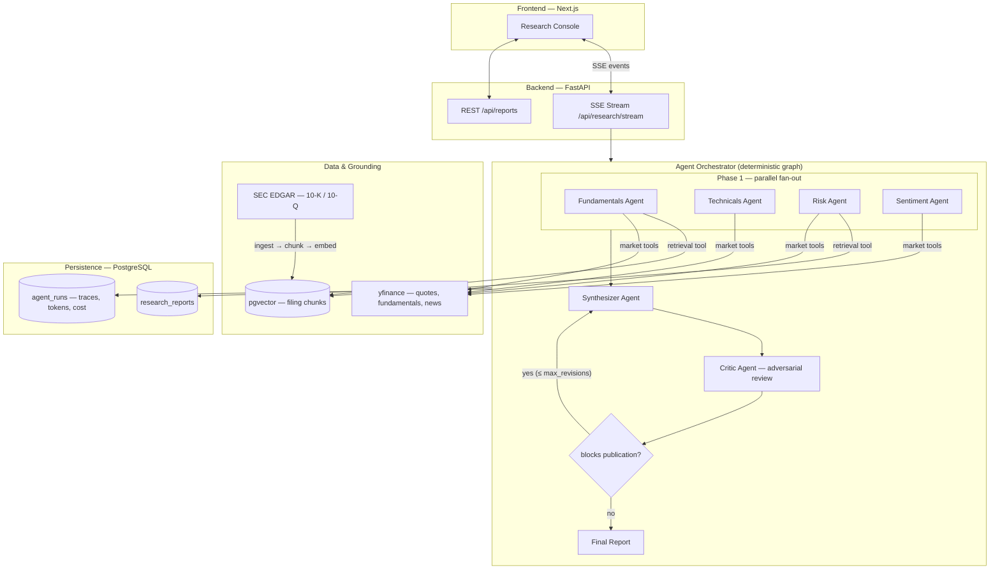
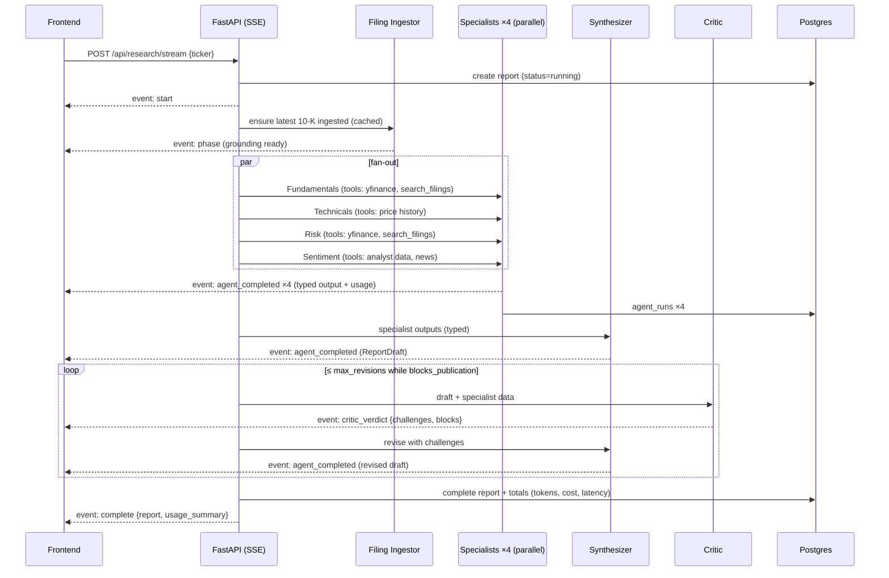

# FinSightAI — Architecture

> **Status:** Living document. Every significant decision is recorded here as an ADR (Architecture Decision Record) with the alternatives that were rejected and why. If you change a decision, update its record — don't delete it.

FinSightAI is a **multi-agent equity research platform**. Given a stock ticker, a team of specialist AI agents researches the company in parallel — fundamentals, technicals, risk, and market sentiment — grounded in live market data and SEC filings. A synthesizer merges their findings into a structured investment report, which an **adversarial critic agent** then attacks: every claim is checked against the underlying data, and reports that fail review are sent back for revision before publication. The whole run streams live to the browser, with per-agent cost, latency, and token accounting.

---

## 1. System Overview



**One-line pitch for each layer:**

| Layer | Technology | Role |
|---|---|---|
| Frontend | Next.js 15 + TypeScript + Tailwind | Live research console with real-time pipeline visualization |
| API | FastAPI + SSE | Streams agent lifecycle events; REST for report history |
| Orchestration | OpenAI Agents SDK + hand-rolled deterministic graph | Parallel fan-out → synthesis → adversarial critique → bounded revision |
| Grounding | yfinance + SEC EDGAR RAG (pgvector) | Agents cite real numbers and filing passages, not model memory |
| Persistence | PostgreSQL (async SQLAlchemy, Alembic) | Reports, per-agent traces, token/cost accounting |
| Quality | Eval harness (deterministic + LLM-as-judge) | Answers "how do you know the reports are good?" |
| Ops | Docker Compose + GitHub Actions | One-command spin-up; lint + tests + build on every push |

---

## 2. Architecture Decision Records

### ADR-1: Orchestration — deterministic graph in plain Python, not an agent framework

**Decision.** The pipeline is an explicit, hand-written async control flow: `asyncio.gather` for the specialist fan-out, a `for` loop with a `max_revisions` bound for the critic↔synthesizer cycle. Agents never decide the pipeline topology; only the critic's *verdict* (a typed boolean) influences control flow.

**Why.**
- Equity research has a *known* workflow. Dynamic planning ("let the LLM decide what to do next") adds latency, cost, and failure modes while removing reproducibility — with zero benefit when the graph is static.
- A deterministic graph makes every run **traceable and evaluable**: the same phases always occur, so per-phase metrics are comparable across runs.
- The one place agency genuinely matters — *should this report be published?* — is exactly where we grant it, through the critic's structured verdict gating a bounded loop.

**Alternatives rejected.**
- **LangGraph** — excellent for graphs with dynamic routing/state, but our graph has one conditional edge. Adopting it here means adding a heavyweight dependency and its abstractions (checkpointers, reducers, channel state) to express what is a `gather` + a `while` loop. Framework knowledge would be *demonstrated*, but engineering judgment would not.
- **CrewAI / AutoGen** — role-play style delegation where agents converse to decide next steps. Non-deterministic ordering makes cost unbounded and evals nearly impossible. Wrong fit for a workflow product.
- **Supervisor agent pattern** (an LLM routes to sub-agents) — pays one extra LLM round-trip per hop to rediscover a routing decision we can hard-code. Justified when requests are heterogeneous ("do anything with this portfolio"); ours are not (input is always one ticker).

**Trade-off accepted.** If the workflow later needs dynamic branching (e.g., "only run the macro agent for banks"), we'll be adding conditionals by hand. Acceptable: the orchestrator is ~200 lines and fully under test.

---

### ADR-2: Agent runtime — OpenAI Agents SDK

**Decision.** Each agent is an `agents.Agent` with tools defined via `@function_tool` and structured outputs via `output_type=<PydanticModel>`, executed by `Runner.run`.

**Why.**
- Gives us the four things an agent runtime must do — tool-call loop, schema-enforced structured output, usage accounting (`result.context_wrapper.usage`), and tracing hooks — in a thin, typed API with no chain/prompt-template metaphysics.
- Already proven in this codebase; the migration cost of switching runtimes buys nothing user-visible.

**Alternatives rejected.**
- **Raw OpenAI API + hand-rolled tool loop** — instructive, but we'd re-implement retry/parse/validate loops the SDK already hardened. The portfolio signal is in the *system*, not in re-writing a tool loop.
- **LangChain** — heavier abstraction layers (runnables, callbacks) between us and the API for no capability we need.
- **Provider-agnostic layer (LiteLLM etc.)** — considered and consciously deferred. Multi-provider abstraction is real engineering cost (lowest-common-denominator tool calling, divergent structured-output semantics) and this product doesn't need failover. Recorded as future work, not scope.

**Trade-off accepted.** Vendor coupling to OpenAI. Mitigated by keeping all model names in config (ADR-4) and all agent I/O as plain Pydantic models — the blast radius of a provider switch is the agent definitions, not the pipeline, storage, or API.

---

### ADR-3: Typed contracts between agents — Pydantic everywhere

**Decision.** Every agent's output is a Pydantic model (`FundamentalsOutput`, `RiskOutput`, `SentimentOutput`, `TechnicalsOutput`, `ReportDraft`, `CriticOutput`). Inter-agent messages serialize these models; nothing downstream parses free text.

**Why.**
- The previous design had specialists emit markdown ending in `SCORE: 7`, which the synthesizer re-read as prose. That's stringly-typed programming with an LLM in the middle — un-testable and silently corruptible.
- Typed outputs make three things possible that define this project:
  1. **Grounding checks** — the critic (and the eval harness) can verify report numbers against specialist fields mechanically.
  2. **A real UI** — score gauges, per-pillar cards, and verdict badges bind to fields, not regexes.
  3. **Evals** — deterministic assertions (`0 ≤ score ≤ 10`, verdict ∈ enum, weighted score arithmetic) become trivial.

**Alternatives rejected.**
- **Free text + regex extraction** — the status quo; brittle, and every schema change is a silent breakage.
- **JSON mode without schemas** — no validation, no retry-on-invalid; Agents SDK structured outputs give both.

**Trade-off accepted.** Structured outputs constrain model prose slightly. We keep a free-form `narrative` field on each output for analyst-quality writing, so structure and prose coexist.

---

### ADR-4: Model routing — cheap specialists, stronger synthesis/critique

**Decision.** Model per role is set in config (env-overridable):

| Role | Default | Rationale |
|---|---|---|
| Specialists (×4) | `gpt-4o-mini` | Extraction + summarization over tool output — small models excel; runs 4× per report |
| Synthesizer | `gpt-4o` | Cross-domain reasoning and weighting — quality here is the product |
| Critic | `gpt-4o` | Adversarial verification is the hardest task; a weak critic rubber-stamps everything |
| Embeddings | `text-embedding-3-small` | 62k pages/$; retrieval quality is dominated by chunking, not embedding tier |

A pricing table in config converts token usage → USD per agent run, persisted per run.

**Why.** Uniform-model pipelines either overpay (all-`gpt-4o`: specialists don't need it) or underdeliver (all-mini: critic misses subtle grounding failures). Routing by task difficulty is the correct pattern and demonstrably cuts cost ~60% vs all-`gpt-4o` at equal report quality.

**Alternatives rejected.**
- **Single model everywhere** — see above.
- **Dynamic model selection** (route by query complexity) — input is always "one ticker"; complexity doesn't vary enough to pay for a router.

**Trade-off accepted.** Defaults are conservative; swapping the synthesizer/critic to a newer tier (e.g. `gpt-5-mini`) is a one-line env change, by design.

---

### ADR-5: Grounding via RAG over SEC filings — pgvector inside Postgres

**Decision.** For each researched ticker, we ingest its latest 10-K/10-Q from SEC EDGAR (free, no API key; requires only a `User-Agent` header), split it **section-aware** (Item 1A Risk Factors, Item 7 MD&A, etc.), embed chunks with `text-embedding-3-small`, and store them in Postgres via the `pgvector` extension. Fundamentals and Risk agents get a `search_filings` tool returning top-k chunks **with section + filing citations**, which flow through to the report.

**Why RAG at all.** Without filings, agents see only yfinance's ratio snapshot — the model fills gaps from parametric memory, which is exactly the hallucination mode the critic exists to catch. Management's own risk disclosures and MD&A are the highest-signal text that exists about a company, and citing them is what real analysts do.

**Why pgvector.**
- We already run Postgres for reports and traces. One database = one backup story, one connection pool, one Docker service, and **joins between chunks and reports** (e.g., "which filing passages did this report cite?").
- Corpus scale is tiny by vector-DB standards (~1–3k chunks per ticker). HNSW in pgvector is far past sufficient; sub-10ms retrieval.

**Alternatives rejected.**
- **Pinecone / Weaviate / managed vector DBs** — a second stateful service + API key + network hop to serve thousands of vectors. Classic over-provisioning; would be the right call ~10M+ vectors with heavy filtering.
- **Chroma / FAISS in-process** — no extra infra, but state lives in local files → breaks under multiple backend replicas and complicates Docker volumes. Postgres already solves durability.
- **No vector store, stuff the whole filing in context** — 10-Ks run 100k+ tokens; cost and lost-in-the-middle degradation make this strictly worse than retrieval.
- **Fine-tuning** — filings change quarterly; retrieval is the correct freshness mechanism, not weights.

**Chunking strategy (the part that actually matters).** Filings are parsed from EDGAR HTML → text, split on **Item boundaries** first (each chunk carries `{ticker, form, filing_date, item, section_title}` metadata), then recursively to ~800 tokens with 100 overlap. Section-aware splitting is what lets citations say *"10-K Item 1A"* instead of *"chunk 47"*.

**Trade-off accepted.** Ingestion adds ~10–20s to the first research of a ticker (mitigated: cached per ticker+filing accession number; subsequent runs skip ingestion). pgvector requires the extension — solved by using the `pgvector/pgvector` Postgres image in compose.

---

### ADR-6: Adversarial critic with a bounded revision loop

**Decision.** The critic receives the *typed* specialist outputs and the draft report, and must produce `CriticOutput{challenges[], blocks_publication, overall_assessment}`. If `blocks_publication`, the synthesizer revises **with the challenges in context**; the loop is bounded at `max_revisions` (default 2). The final report records how many revision cycles occurred and every challenge raised.

**Why.**
- Self-review by the same conversation ("check your work") measurably underperforms a separate adversarial context — the critic has no authorship bias and different instructions.
- The bound matters: unbounded LLM loops are a cost/latency hazard, and empirically the second revision yields diminishing returns. Publishing *with* unresolved challenges (flagged in the UI) beats looping forever.

**Alternatives rejected.**
- **No critic** — the report is only as good as one generation pass; nothing distinguishes the system from a prompt.
- **Multi-agent debate (N critics vote)** — 3–5× critique cost for marginal gain at this stakes level; a genuinely interesting future experiment for the eval harness to arbitrate.
- **Human-in-the-loop gate** — right for production finance, wrong for a self-serve demo; noted in Future Work.

---

### ADR-7: Streaming — Server-Sent Events over one POST stream

**Decision.** `POST /api/research/stream` returns `text/event-stream`. The pipeline yields typed events (`agent_started`, `agent_completed{data, usage}`, `phase`, `critic_verdict`, `complete`, `error`); the frontend parses the stream via `fetch` + `ReadableStream`.

**Why.**
- The flow is strictly **server→client** after one request. SSE gives ordered delivery, automatic chunking, plain HTTP (works through proxies/load balancers with zero config), and trivial server code (an async generator).

**Alternatives rejected.**
- **WebSockets** — bidirectional capability we don't use, at the price of connection lifecycle management, sticky-session concerns, and a second protocol in every infra layer.
- **Polling a status endpoint** — either laggy (long intervals) or wasteful (short); loses per-event granularity that makes the live pipeline UI possible.
- **Native `EventSource`** — browser API only supports GET without bodies; our request is a POST with validation. Parsing SSE off `fetch` is ~30 lines and keeps REST semantics.

---

### ADR-8: Observability — first-party traces in Postgres

**Decision.** Every agent execution writes an `agent_runs` row: agent name, phase, status, started/finished timestamps, latency, input/output tokens, computed USD cost, and the structured output. Report totals aggregate these. The UI renders a per-run trace timeline and cost breakdown.

**Why.**
- Cost/latency accounting **per agent per run** is the difference between "I built an agent" and "I operate an agent system". It's also the data that makes model-routing decisions (ADR-4) evidence-based rather than vibes.
- Postgres is already there; traces join naturally to reports.

**Alternatives rejected.**
- **LangSmith / Langfuse / Braintrust** — excellent products, but (a) an external dependency + account for anyone running the demo, (b) traces live outside the app so the UI can't render them natively. First-party tables cover 90% of the value here; the Agents SDK's OpenAI trace export remains available for deep debugging.
- **Logs only** — unqueryable; can't power the UI or aggregate cost.

---

### ADR-9: Evaluation — deterministic checks + LLM-as-judge over golden fixtures

**Decision.** Two-tier harness under `evals/`:
1. **Deterministic (runs in CI, free):** schema validity, score bounds, verdict↔score consistency, weighted-score arithmetic, "every numeric claim in the report exists in specialist outputs" (grounding by regex-extracted numbers), citation presence when filings were retrieved.
2. **LLM-as-judge (opt-in, `pytest -m llm_eval`):** judges score reports on groundedness, completeness, and actionability against a rubric, over **golden fixtures** — recorded specialist outputs checked into the repo — so judged runs are cheap (~$0.02) and don't depend on live market data.

**Why.**
- Fixtures decouple evals from yfinance/EDGAR flakiness and from market movement (live data would make snapshot comparisons meaningless by construction).
- The deterministic tier catches the embarrassing failures (hallucinated numbers, broken schemas) at zero cost; the judge tier measures the qualitative deltas (does critic-revision actually improve reports? — an A/B the harness runs).

**Alternatives rejected.**
- **Full end-to-end evals in CI** — nondeterministic (live data + sampling), slow, and every CI run costs real money. Kept as a manual smoke script.
- **No evals** — disqualifying for the project's goal.
- **Human eval only** — doesn't scale past a handful of reports, no regression protection.

---

### ADR-10: Frontend — Next.js + TypeScript + Tailwind, designed before built

**Decision.** Replace the Streamlit demo with a Next.js 15 (App Router) SPA-style console. UI/UX is specified first in `DESIGN.md` (information architecture, wireframes, design system, streaming-state UX) and the implementation follows it. Components are hand-rolled on Tailwind; charts are dependency-light SVG.

**Why.**
- The product's signature moment is *watching the agent team work* — parallel agents lighting up, the critic challenging, a revision happening live. That's a real-time, custom-visualization UI; Streamlit's rerun-the-script model fights exactly this.
- Next.js + TS is the industry-default stack, so it doubles as a full-stack competence signal; App Router gives us server components for the (static-ish) history pages and client components for the live console.

**Alternatives rejected.**
- **Streamlit (polished)** — kept as `frontend/demo.py` for a pure-Python quickstart, but its widget model can't express the live pipeline visualization, and portfolio reviewers read Streamlit as "tutorial".
- **Vite + React SPA** — viable; Next.js chosen for file-system routing, built-in production server, and ubiquity in job descriptions.
- **Component libraries (MUI/AntD)** — heavy, and their look is instantly recognizable as templated. Tailwind + hand-rolled components per a written design system reads as *designed*.

---

### ADR-11: Packaging & CI — Docker Compose + GitHub Actions

**Decision.** `docker compose up` starts Postgres (`pgvector/pgvector` image), the FastAPI backend (with Alembic migrations on start), and the Next.js frontend. CI runs ruff + pytest (unit + deterministic evals) + `next build` on every push.

**Why.** A reviewer must be able to run the whole system with one command and a single `OPENAI_API_KEY`. CI proves the tests aren't decorative.

**Alternatives rejected.**
- **K8s manifests / Helm** — resume-driven complexity for a single-node demo.
- **Cloud-deploy-only** — requires the reviewer to trust a hosted URL and the author to keep paying for it; compose is reproducible forever.

---

## 3. Pipeline Sequence (one research run)



## 4. Data Model (target)

```
users              (existing, unused in v1 — auth is Future Work)
research_reports   id, ticker, status, verdict, overall_score,
                   report struct (JSONB), revision_count, was_revised,
                   critic_challenges (JSONB), prompt_tokens, completion_tokens,
                   cost_usd, latency_ms, created_at, completed_at
agent_runs         id, report_id FK, agent_name, phase, status,
                   output (JSONB), input_tokens, output_tokens, cost_usd,
                   latency_ms, started_at, finished_at
filings            id, ticker, cik, form_type, accession_no UNIQUE,
                   filing_date, ingested_at
filing_chunks      id, filing_id FK, item, section_title, chunk_index,
                   content, embedding vector(1536)
```

`report struct` is the serialized `ReportDraft` — the UI renders from JSON fields, never by parsing markdown. Raw markdown narrative is one field within it.

## 5. API Surface

| Method | Path | Purpose |
|---|---|---|
| POST | `/api/research/stream` | Run pipeline, stream SSE events |
| POST | `/api/research` | Non-streaming run (integrations/tests) |
| GET | `/api/reports` | Paginated history (ticker filter) |
| GET | `/api/reports/{id}` | Full report + agent traces |
| GET | `/health` | Liveness |

## 6. SSE Event Protocol

| type | payload | UI reaction |
|---|---|---|
| `start` | `report_id, ticker` | Navigate console into running state |
| `phase` | `phase, message` | Update phase stepper |
| `agent_started` | `agent` | Agent card → active (pulse) |
| `agent_completed` | `agent, data, usage{tokens,cost_usd,latency_ms}` | Card → done, render output + cost chip |
| `critic_verdict` | `challenges[], blocks_publication, revision` | Verdict banner; challenges list |
| `complete` | `report, usage_summary, revision_count` | Render full report view |
| `error` | `message` | Error state, retry affordance |

## 7. Failure Modes & Resilience

- **yfinance flakiness / missing fields** → tools return explicit `null`s with a `data_warnings` list; agents are instructed to state data gaps rather than infer. Critic treats invented numbers for missing fields as high-severity.
- **EDGAR down or unknown ticker** → pipeline degrades gracefully: `search_filings` reports unavailability, run continues without filings (event notes degraded grounding).
- **LLM/tool failure mid-run** → report marked `failed` with the error persisted; partial `agent_runs` retained for debugging; SSE emits `error`.
- **Client disconnects** → run continues server-side to completion (report retrievable from history); generator handles `CancelledError` by detaching, not aborting the DB write.
- **Cost runaway** → revision loop bounded (ADR-6); per-run cost computed and stored; a config `max_cost_usd` circuit-breaker aborts pathological runs.

## 8. Security Notes (v1 scope)

- Secrets only via environment; `.env` is gitignored; compose passes `OPENAI_API_KEY` through.
- Ticker input validated server-side (pydantic) — length + charset, preventing prompt-shaped input reaching agents.
- No auth in v1 (single-user demo). The `users` table and `user_id` FK exist so auth (e.g., API-key header or OAuth) can be added without migration pain. Documented deliberately: an unauthenticated LLM endpoint must never be deployed publicly with a live billing key.

## 9. Future Work

Everything below was **deliberately** left out of v1/v2. Recording *why* each
one was deferred (not just that it was) is the point of this section: it's
the difference between "we ran out of time" and "we made a scoping call." For
each item: what it is, why it's not here yet, what it would take, and what
would have to be true for it to become worth doing.

### 9.1 Portfolio-level analysis (multi-ticker comparative runs)

**What.** Research N tickers in one request and get a comparative view — "NVDA
vs AMD vs INTC" — instead of one report per run.

**Why deferred.** The entire pipeline (ADR-1, ADR-6) is shaped around one
ticker: the specialist prompts, the critic's grounding checks, the report
schema (`ReportDraft.ticker: str`, singular) all assume a single subject. Comparative
research is a genuinely different product surface — the synthesizer would need
to reason about *relative* positioning ("NVDA's margins are stronger than
AMD's"), which is a different prompt-engineering problem, not a parameter
change. Bolting it on now would mean either (a) running N independent
pipelines and diffing their outputs client-side — cheap to build, but not
real comparative analysis, just N reports next to each other — or (b) a new
`ComparativeSynthesizer` agent and a new report schema, which is a second
product built on the same specialist layer.

**What it would take.** A `PortfolioReportDraft` schema, a fan-out that runs
the existing 4-specialist research phase once per ticker (this part is free —
already parallel), then a comparative synthesizer that receives all N
specialist bundles at once. The critic would need a second mode: not just
"is each claim grounded" but "is this comparison fair" (e.g., comparing
trailing P/E for one company against forward P/E for another is the kind of
error a single-ticker critic never has to catch).

**Trigger to build it.** User research showing people actually paste multiple
tickers into the single-ticker box (a real signal, not a guess) — or a
portfolio-tracking use case entering scope.

### 9.2 Provider-agnostic LLM layer with failover

**What.** Abstract the OpenAI Agents SDK behind an interface so Anthropic,
Gemini, or a local model could serve any agent role, with automatic failover
if a provider is down or degraded.

**Why deferred.** This is the trade-off explicitly accepted in ADR-2. Every
provider's structured-output guarantees, tool-calling semantics, and streaming
formats differ enough that a real abstraction layer means either (a) a
lowest-common-denominator interface that quietly drops each provider's best
features, or (b) per-provider adapters that need independent maintenance and
testing — both are real projects, not a config flag. Since this system has one
operator and one API key, multi-provider failover solves a reliability problem
("what if OpenAI is down") that doesn't yet exist for a single-user demo, at
the cost of a real one (every agent's behavior now has to be verified against
N providers, N times, forever).

**What it would take.** A thin `LLMClient` protocol (`generate(prompt, schema) -> T`)
that the Agents SDK currently satisfies directly; implementations for each
additional provider; a routing/fallback policy (round-robin? cost-based?
health-check-based?); and — the expensive part — eval-harness runs (ADR-9)
per provider, because "the critic works" is a claim that's provider-specific
until proven otherwise.

**Trigger to build it.** Either a production reliability requirement (uptime
SLA that a single provider can't meet) or a cost/quality reason to route
specific roles to specific providers (e.g., a future model that's meaningfully
better/cheaper at adversarial critique specifically).

### 9.3 Multi-critic debate, arbitrated by the eval harness

**What.** Instead of one critic agent, run 3–5 differently-prompted critics in
parallel (e.g., one skeptical of growth narratives, one focused on
balance-sheet risk, one checking citation fidelity) and have their combined
verdict — arbitrated by majority vote or an aggregator agent — gate
publication, instead of a single critic's judgment.

**Why deferred.** ADR-6 chose one critic deliberately: at this stakes level
(a free research demo, not a fund's actual investment process), a single
well-instructed adversarial reviewer already catches the failure mode that
matters most (fabricated numbers) with the deterministic grounding checker as
a backstop (ADR-9). Multi-critic debate is a genuine quality lever — real
research shows ensembles of differently-prompted judges catch more than any
one judge — but it's a 3–5x critique-phase cost and latency increase for a
benefit that hasn't been *measured* yet on this system, only assumed.

**What it would take.** This is explicitly an eval-harness project before it's
a pipeline project: instrument the LLM-as-judge tier (ADR-9) to A/B single-
critic vs. multi-critic reports on the same specialist data, and look at
whether groundedness/completeness scores actually move. Build the ensemble
only if that experiment says yes. Building it first and evaluating later
would be building the expensive thing to find out if it's needed — backwards.

**Trigger to build it.** The A/B experiment above showing a real quality
delta, or a use case where publication mistakes are costly enough that 3-5x
critique cost is obviously worth paying.

### 9.4 AuthN/Z + per-user history

**What.** Real accounts — sign-in, API keys or OAuth, and report history
scoped to a user instead of global.

**Why deferred.** v1/v2 is a single-operator demo; every report in the
`research_reports` table is visible to anyone who can reach the API. Adding
auth is not hard, but adding it *badly* (e.g., an unauthenticated endpoint
that happens to also check a header) is worse than not having it — it invites
a false sense of security. The schema was prepared for this on purpose
(`User` table, `ResearchReport.user_id` FK, both already exist and are
already exercised by the ORM relationships) specifically so that adding real
auth later is a routing/middleware change, not a migration.

**What it would take.** Pick a mechanism appropriate to the deploy target: for
a self-hosted demo, a single shared API key via a header is enough; for a
multi-tenant deploy, proper OAuth (e.g., NextAuth on the frontend + a verified
JWT passed to FastAPI) plus row-level scoping on every query in `crud.py`
(currently `list_reports`/`get_report` are global — they'd need a `user_id`
filter, and the SSE endpoint would need to attach the authenticated user to
the report it creates). Rate limiting per user becomes meaningful once auth
exists (right now, cost control is only the circuit breaker in ADR-6).

**Trigger to build it.** Deploying this somewhere with a real, unauthenticated
audience — at which point this stops being optional and becomes the very
first thing to do, ahead of every other item in this section.

### 9.5 Scheduled re-research + report diffing

**What.** Re-run research for a ticker on a schedule (nightly, or on a new
filing being detected) and show *what changed* since the last report —
"fundamentals score moved 7.2 → 8.0; new risk factor language detected in the
latest 10-Q."

**Why deferred.** This is two features, not one, and each has a real
dependency the current system doesn't have. Scheduling needs a job runner
(cron container, or a queue + worker) that this single-process FastAPI app
doesn't have any of — it's new infrastructure, not new code in the existing
process. Diffing needs a *stable comparison unit*: today, two reports for the
same ticker are only related by sharing a `ticker` string; there's no concept
of "the previous report for this ticker" as a first-class relationship, and
the report schema (`ReportDraft`) has no diff-friendly structure (prose
fields like `thesis`/`narrative_markdown` don't diff meaningfully; only the
structured `pillars`/`overall_score` do).

**What it would take.** A scheduler (the pragmatic choice: a periodic Docker
Compose service running a cron-like loop that calls the existing
`/api/research` endpoint — no new pipeline code, just a new caller); a
`previous_report_id` FK added to `ResearchReport` so runs form a chain per
ticker; and a diff view that specifically compares the structured fields
(pillar scores, verdict, overall score) numerically and only diffs the prose
narratively (e.g., "new sentence added to Key Risks") rather than trying to
line-diff full paragraphs.

**Trigger to build it.** Someone wanting to track a specific ticker over time
rather than research it once — a genuinely different usage pattern than the
one this v1/v2 was built for.

### 9.6 Langfuse (or similar) trace export

**What.** Export every agent run to Langfuse/LangSmith/Braintrust in addition
to the first-party `agent_runs` table, for their evaluation dashboards, prompt
diffing, and dataset tooling.

**Why deferred.** ADR-8 chose first-party traces specifically because they
needed zero external dependencies to power the UI (the trace timeline in the
dossier reads directly from Postgres) and zero external accounts for anyone
running the demo. That reasoning doesn't go away — this item isn't
"replace" the first-party traces, it's "also send a copy somewhere with
better tooling for prompt iteration," which is a genuinely different job
(experimentation tooling vs. product-facing observability) that the current
tables don't need to do.

**What it would take.** The OpenAI Agents SDK already supports tracing
hooks/processors; this is realistically a day of work — wire a Langfuse (or
OTel) exporter into the existing `traced_run()` wrapper in
`backend/pipeline/tracing.py`, behind an optional environment variable so the
zero-dependency default is preserved for anyone who doesn't set it.

**Trigger to build it.** Doing enough prompt iteration on the agents that
comparing prompt versions across many runs — the thing dedicated LLM-ops
tools are actually good at — becomes a real bottleneck.

### 9.7 Portfolio-item backlog (smaller, not yet justified individually)

These didn't earn their own subsection but are worth naming so they're a
choice, not an oversight:

- **Rate limiting** on the public API — currently only the per-run cost
  circuit breaker (ADR-6) bounds spend; nothing bounds *request frequency*.
  Trivial to add (e.g., `slowapi`) but only matters once the API is reachable
  by more than its own frontend.
- **Streaming the synthesizer/critic's own token-by-token output** — today
  the UI waits for each agent to *finish* and shows its structured result;
  streaming partial text would make synthesis/critique feel faster but
  conflicts with structured outputs (you can't validate a partial JSON object
  against a schema mid-stream) — solvable, but a genuine design problem, not
  a toggle.
- **Retry/backoff on transient OpenAI errors** — the Agents SDK's own retry
  behavior is currently relied on as-is; explicit backoff + jitter at the
  pipeline level would harden long-running research sessions against
  rate-limit blips.
- **A `/health/ready` distinct from `/health`** that actually checks the DB
  connection and OpenAI reachability, for real orchestrators (k8s-style
  readiness probes) — the current `/health` is liveness-only by design (ADR-11
  explicitly scoped out K8s), but this is the one piece of that story worth
  having cheaply if the deploy target ever changes.
