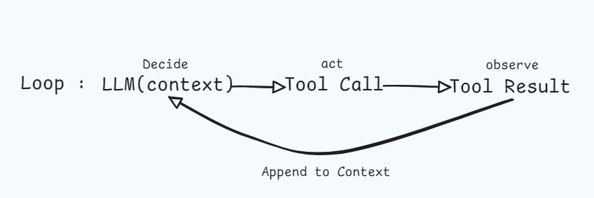
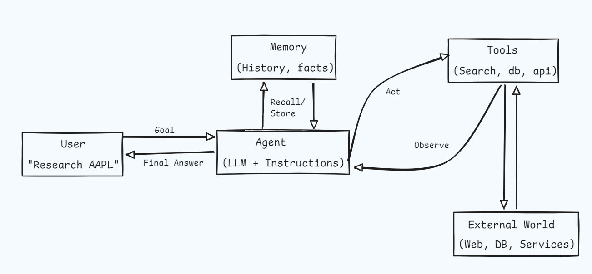
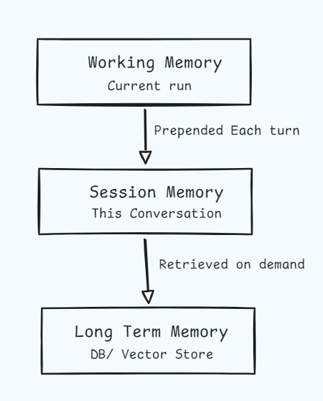
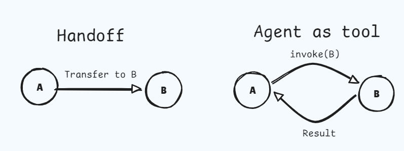

# OpenAI Agents SDK
## Big Picture
Imagine you have a very smart but lazy friend. They can answer almost any question, but they only know things up to last year and they cannot do anything in the real world. They cannot click a button, look up today's stock price, or save a note for you. 
An agent is the same friend, except now you give them a phone, a notebook, and a list of buttons they are allowed to press. You also give them a job: "Research Apple stock for me." They then decide on their own which buttons to press, in what order, until the job is done. That's it. An agent is just an LLM plus a set of tools plus a goal.

Formally, an agent is a control loop with the following shape:
<div align="center">
  
</div>

### The mental model

<div align="center">
  
</div>

### Where OpenAI Agents SDK fits in the ecosystem
The OpenAI Agents SDK is a thin opinionated layer that sits above the raw OpenAI client. It does not replace the API. It gives you batteries-included primitives (Agents, Runner, Tool, Handoff, Guardrail, Session). 

## Full Concepts

### Agent 
An agent is a role. "You are a financial analyst. You speak in clear bullets. You always cite sources. You can use the `web_search` and `fetch_filing` tools." That description, plus a model behind it, is the agent.

In the SDK, an Agent has four required ideas and several optional ones:
1. **instructions**: the system prompt; the personality and rules
2. **model**: which LLM is the brain
3. **tools**: a list of callables the model is allowed to invoke 
4. **output_type**: Optional Pydantic model for structured output 
5. **handoffs**: Other agents this agent may transfer control to
6. **guardrails**: input/output validators that gate the run 

```python
from agents import Agent

market_research_agent = Agent(
    name="Market Research",
    instructions="""
    You are a meticulous equity research analyst.
    Always cite primary sources. Never invent numbers.
    If unsure, call a tool rather than guessing.
    """
)
```

### Tools
A tool is a Python function the model is allowed to call. The SDK inspects the function's signature and docstring, ships them to the model as a JSON schema, and when the model decides it needs data, the SDK calls the function for you and feeds the return value back into the conversation.

```python
from agents import function_tool
from pydantic import BaseModel

class Quote(BaseModel):
    ticker: str
    price: float
    currency: str
    as_of: str

@function_tool
async def get_market_quote(ticker: str) -> Quote:
    """
    Return the latest market quote for the given ticker symbol.
    Args:
        ticker: Uppercase symbol, e.g. 'AAPL', 'MSFT' 
    """
    data = await market_data_client.latest(ticker)

    return Quote(
        ticker=ticker,
        price=data.price,
        currency=data.currency,
        as_of=timestamp.isoformat()
    )
```

### Memory and Context
Every API call is independent. "Memory" is just text we paste back in at the start of every call. Different memory strategies are different ways of choosing what text to paste. 
There are three layers worth distinguishing:
1. **Working Memory**: the current run's message list. The SDK manages this inside the loop.
2. **Session memory**: conversation history across runs, keyed by a session ID. The SDK provides Session backends.
3. **Long term Memory**: facts and artifacts persisted to your DB/vector store, retrieved on demand via a tool.

<div align="center">
  
</div>

### Planning
There are two flavors of planning in modern agents:
1. **Implicit planning**
    - The model thinks step-by-step inside a single LLM call.
    - Chain of Thought, ReAct.
    - The SDK supports this out of the box, you don't do anything. 
2. **Explicit planning**
    - A dedicated planner agent emits a structured plan (Pydantic), and worker agents execute steps. 
    - Useful when runs are long, branching, or auditable.

```python
from pydantic import BaseModel
from typing import Literal

class PlanStep(BaseModel):
    id: int
    action: Literal["fundamentals", "sentiment", "risk", "summarize"]
    rationale: str

class ResearchPlan(BaseModel):
    ticker: str
    horizon_days: int
    steps: list[PlanStep]

planner = Agent(
    name="Planner",
    instructions="Produce a 3-6 step research plan. Be specific.",
    model="gpt-4o-mini",
    output_type=ResearchPlan
)
```

### Multi-Agent Coordination

The SDK gives you two coordination primitives:
1. **Handoff** 
    - Agent A transfers the entire conversation to agent B.
    - B sees A's history and continues.
    - The user feels one coherent assistant; under the hood the brain swapped.
2. **Agent as Tool**
    - Agent A wraps agent B as a callable tool.
    - A stays in control.
    - B is summoned for sub-tasks and returns a single answer.

<div align="center">
  
</div>

#### When to Handoff vs Wrap as tool?
- Handoff when the user-facing voice should change ("Transferring you to billing").
- Wrap as tool when the orchestrator should remain the spokesperson and just delegate sub-questions. 

### Function Calling 
Function calling is the wire-level mechanism behind tools. The model emits a JSON object `{name, arguments}`, the runtime executes it, and the result is fed back as a tool message. The SDK hides all the schema generation and dispatch.

### Streaming 
Three streamable event types matter:
    - **Token deltas**: Show the answer as it types.
    - **Tool events**: Calling `web_search..` UX.
    - **Handoff events**: "Transferring to RiskAgent.." UX.

```python
from agents import Runner

async def stream_research(query: str, session_id: str):
    result = Runner.run.streamed(triage_agent, query, session=Session(session_id))
    async for event in result.stream_events():
        if event.type == "raw_response_event":
            yield {"type": "token", "delta": event.data.delta}
        elif event.type == "agent_updated_stream_event":
            yield {"type": "handoff", "agent": event.new_agent.name}
        elif event.type == "run_item_stream_event":
            yield {"type": "tool", "name": event.item.tool_name}
```

### Guardrails and Safety 
A guardrail is a bouncer. It stands at the door of the agent run, peeks at the input (or output), and either lets it through or stops everything with a polite refusal.

- *Input guardrails* run before the model. Use them to block PII, prompt injection, off-topic, or out-of-scope queries. 
- *Output guardrails* run after the model. Use them to enforce structure, redact secrets, or veto policy violations.

```python
from agents import input_guardrail, GuardrailFunctionOutput

class TopicCheck(BaseModel):
    is_finance_related: bool 
    reasoning: str

topic_judge = Agent(
    name="TopicJudge",
    instructions="Return True iff the user's query is about finance, investing, markets, companies, or economics.",
    output_type=TopicCheck,
    model="gpt-4o-mini",
)

@input_guardrail
async def stay_on_topic(ctx, agent, user_input):
    verdict = await Runner.run(topic_judge, user_input)
    return GuardrailFunctionOutput(
        output_info=verdict.final_output,
        tripwire_triggered=not verdict.final_output.is_finance_related,
    )
```