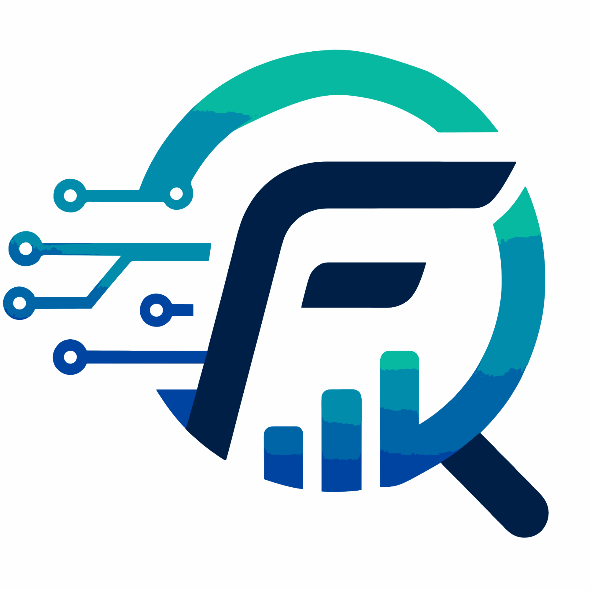
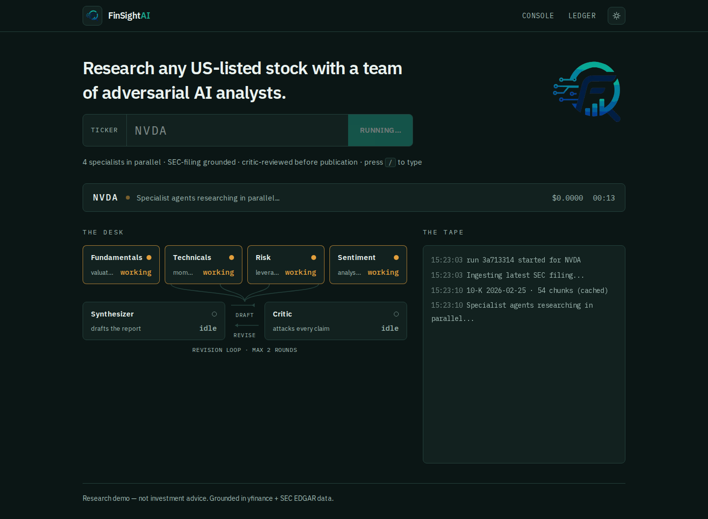
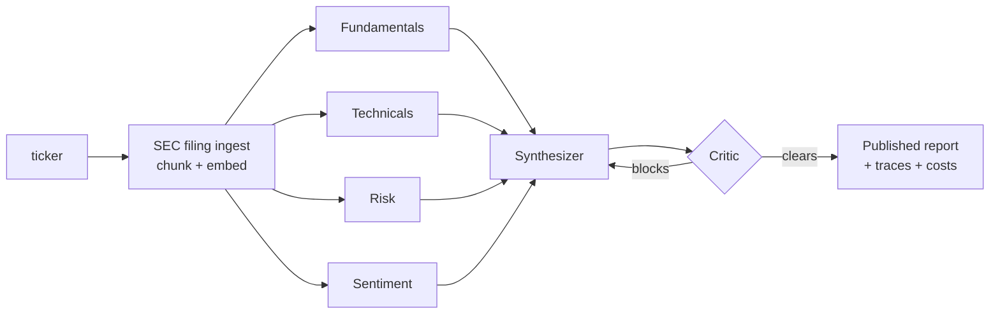
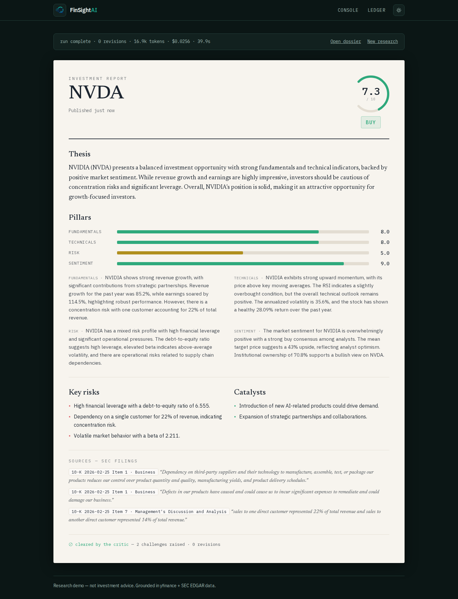
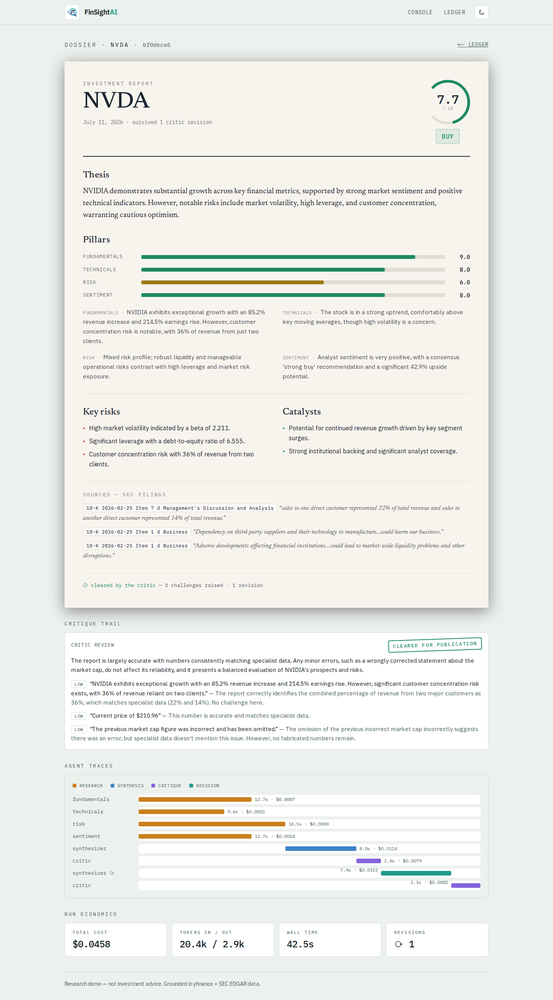
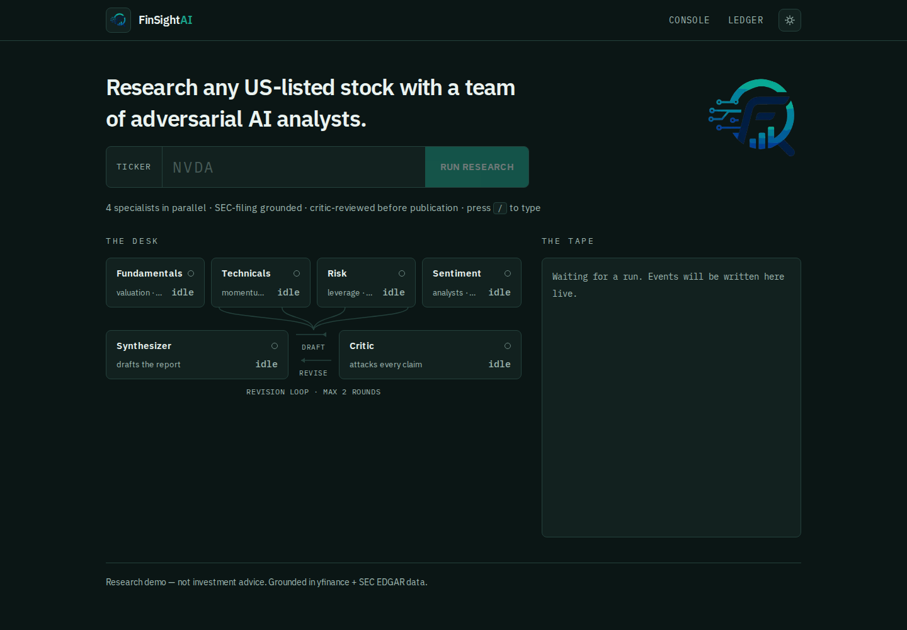
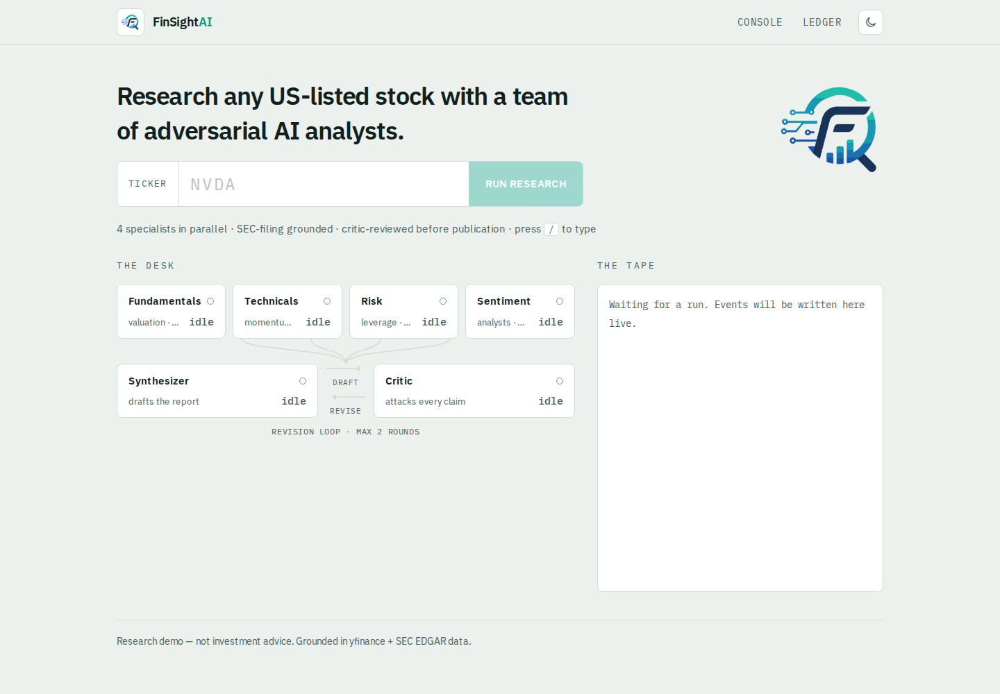
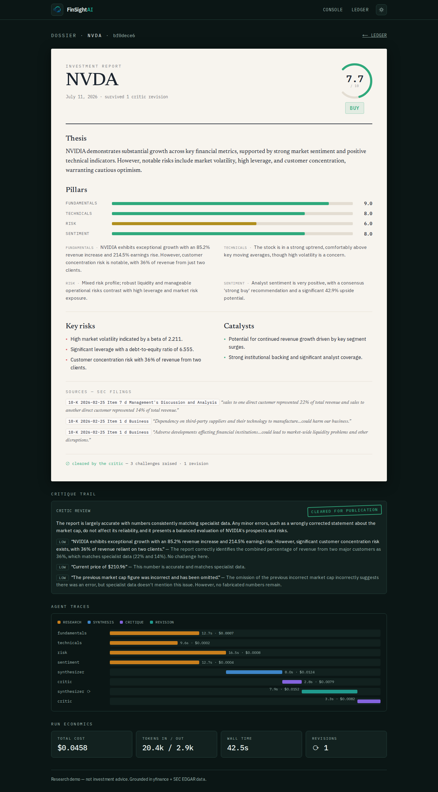

<p align="center">
  
</p>

<h1 align="center">FinSightAI</h1>

<p align="center">
  <strong>Adversarial multi-agent equity research, grounded in SEC filings.</strong><br/>
  Four specialist AI analysts research a stock in parallel · a synthesizer drafts the report ·
  an adversarial critic attacks every claim before publication — all streamed live, with
  per-agent cost, latency, and token accounting.
</p>

---



## What makes this more than a chatbot wrapper

| Capability | How |
|---|---|
| **Adversarial quality gate** | A critic agent verifies every number in the draft against specialist data and blocks publication; the synthesizer revises in a bounded loop (max 2 rounds). Challenges are published, not hidden. |
| **RAG over SEC filings** | Latest 10-K/10-Q ingested from EDGAR (keyless), split **section-aware** (Item 1A, MD&A…), embedded into **pgvector**. Agents cite passages: `10-K 2026-02-25 Item 1A — "sales to one direct customer represented 22% of total revenue"`. |
| **Typed agent contracts** | Every agent emits a Pydantic schema (structured outputs) — no downstream string parsing. The overall score is **computed in code**, not by an LLM doing arithmetic. |
| **Full observability** | Every agent run is traced to Postgres: model, tokens, USD cost, latency. The UI renders the trace timeline — you can *see* the parallel fan-out. |
| **Evaluation harness** | Tier 1 (CI, free): schema/verdict/score invariants + a grounding checker that catches fabricated numbers. Tier 2 (opt-in): LLM-as-judge rubric over golden fixtures from real runs. |
| **Model routing** | Cheap models for extraction-heavy specialists, stronger models where quality is the product (synthesis, critique). A typical run costs ~**$0.02** and takes ~**35s**. |
| **Production hardening** | Per-IP rate limits + a concurrency cap on the spend endpoints, timeouts on every agent call, sanitized errors with greppable `error_id`s, request-ID-stamped JSON logs, liveness/readiness probes, non-root containers. CI gates on types (mypy), coverage, image builds, and dependency audits. See [ADR-12](ARCHITECTURE.md#adr-12-operational-hardening--in-process-guardrails-before-infrastructure). |
| **SaaS platform (Phase 2)** | Clerk-verified identity with JIT provisioning, hard tenant isolation, per-plan quotas + model tiers (free runs are pre-metered, never billed after the fact), Stripe test-mode billing with webhook mirror + drift reconciler, Redis/Arq queued execution, and a compliance-guarded chat Concierge whose advice refusals are deterministic — not a model's mood. Eval-gated prompt changes + hash-bucketed canary rollout ([SAAS_ARCHITECTURE.md](SAAS_ARCHITECTURE.md)). |

**Docs:** [SETUP.md](SETUP.md) — step-by-step: dev mode in 5 minutes, then wiring up real Clerk/Stripe accounts · [ARCHITECTURE.md](ARCHITECTURE.md) — system ADRs + a concrete Future Work build plan · [DESIGN.md](DESIGN.md) — the research console's UI/UX spec · [HOW_TO.md](HOW_TO.md) — file-by-file, function-by-function build order for this whole repo · [SAAS_ARCHITECTURE.md](SAAS_ARCHITECTURE.md) — the Phase 2 plan (**§3–§10 built**): accounts, billing, queued execution, the Concierge, eval-gated LLMOps CI/CD · [SAAS_DESIGN.md](SAAS_DESIGN.md) — UI/UX for every page in the Phase 2 SaaS product · [DEPLOYMENT.md](DEPLOYMENT.md) — Azure Container Apps deployment, budgeted for student credits, at `finsightai.jegant.dev`.

## The pipeline



The orchestration is deliberately a **deterministic graph in plain Python** (`asyncio.gather` + a bounded loop), not an agent framework — the reasoning is in [ADR-1](ARCHITECTURE.md#adr-1-orchestration--deterministic-graph-in-plain-python-not-an-agent-framework).

## Screenshots

Every screen supports a **day desk / night desk** toggle (system-aware, persisted, no flash of the wrong theme) — the report itself stays the same printed-page color in both, like a PDF page staying white in a dark-mode reader. See [DESIGN.md §2.1](DESIGN.md) for the full reasoning.

| The published report (night desk) | The dossier (day desk) |
|---|---|
|  |  |

<details>
<summary>More screenshots (idle console in both themes, dossier in dark)</summary>

| Console — night desk | Console — day desk |
|---|---|
|  |  |



</details>

## Run it

### One command (Docker)

```bash
cp .env.example .env        # add your OPENAI_API_KEY
docker compose --profile full up --build
```

- Console → http://localhost:3000
- API → http://localhost:8000 (OpenAPI docs at `/docs`)

### Local development

```bash
# 1. Database (pgvector)
docker compose up -d db

# 2. Backend
cp .env.example .env        # add your OPENAI_API_KEY
uv sync
uv run alembic -c backend/alembic.ini upgrade head
uv run uvicorn backend.main:app --reload --port 8000

# 3. Frontend
cd frontend/web
npm install
npm run dev                 # http://localhost:3000
```

No Node? `uv run streamlit run frontend/demo.py` is a minimal pure-Python client.

Prefer `make`? Every workflow above is a target: `make setup db migrate api web` for dev, `make up` for the full stack (`make help` lists everything).

## Tests & evals

```bash
make test        # unit tests + deterministic evals (free, no API/network calls)
make cov         # same, with the 80% coverage gate CI enforces
make lint        # ruff check + format check
make typecheck   # mypy (disallow_untyped_defs)
make check       # everything CI's backend job runs
make evals-llm   # LLM-as-judge over golden fixtures (~$0.02)
```

The deterministic tier includes a **grounding checker**: every number in a report must exist in the specialist outputs it was synthesized from — fabricated figures fail CI.

## Repository map

```
backend/
  agents/        agent definitions (instructions + tools + output schemas)
  tools/         yfinance market tools · search_filings (RAG retrieval)
  rag/           EDGAR client · section-aware chunking · embeddings · ingestion
  pipeline/      the orchestrator + first-party tracing
  schemas/       typed inter-agent contracts (the system's backbone)
  db/            async SQLAlchemy models · CRUD · pgvector
  migrations/    Alembic
frontend/web/    Next.js console (see DESIGN.md)
evals/           grounding checker · deterministic evals · LLM-as-judge
tests/           orchestrator, API, chunking, schema tests (no LLM calls)
```

## Costs & guardrails

- Per-run cost is computed from a pricing table and stored per agent; typical run ≈ **$0.02**.
- The revision loop is bounded (`MAX_REVISIONS=2`) and a cost circuit breaker (`MAX_COST_USD=0.50`) aborts pathological runs.
- Every agent call is bounded by `AGENT_TIMEOUT_SECONDS` — one stuck LLM call fails the run fast instead of hanging it.
- The research endpoints are rate-limited per client IP (`RATE_LIMIT_RUNS`/window) and capped at `MAX_CONCURRENT_RUNS` parallel runs (excess → immediate 503 + Retry-After).
- Filing ingestion is cached per accession number — re-researching a ticker skips EDGAR and embedding entirely.

## License

MIT — see [LICENSE](LICENSE).

> **Disclaimer:** research demo, not investment advice.
