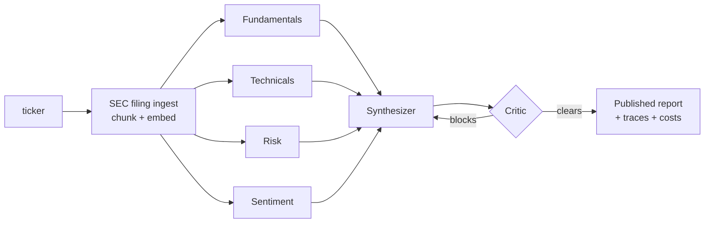

<p align="center">
  
</p>

<h1 align="center">FinSightAI</h1>

<p align="center">
  <strong>Adversarial multi-agent equity research, grounded in SEC filings.</strong><br/>
  Four specialist AI analysts research a stock in parallel · a synthesizer drafts the report ·
  an adversarial critic attacks every claim before publication — all streamed live, with
  per-agent cost, latency, and token accounting.
</p>

---


## What makes this more than a chatbot wrapper

| Capability | How |
|---|---|
| **Adversarial quality gate** | A critic agent verifies every number in the draft against specialist data and blocks publication; the synthesizer revises in a bounded loop (max 2 rounds). Challenges are published, not hidden. |
| **RAG over SEC filings** | Latest 10-K/10-Q ingested from EDGAR (keyless), split **section-aware** (Item 1A, MD&A…), embedded into **pgvector**. Agents cite passages: `10-K 2026-02-25 Item 1A — "sales to one direct customer represented 22% of total revenue"`. |
| **Typed agent contracts** | Every agent emits a Pydantic schema (structured outputs) — no downstream string parsing. The overall score is **computed in code**, not by an LLM doing arithmetic. |
| **Full observability** | Every agent run is traced to Postgres: model, tokens, USD cost, latency. The UI renders the trace timeline — you can *see* the parallel fan-out. |
| **Evaluation harness** | Tier 1 (CI, free): schema/verdict/score invariants + a grounding checker that catches fabricated numbers. Tier 2 (opt-in): LLM-as-judge rubric over golden fixtures from real runs. |
| **Model routing** | Cheap models for extraction-heavy specialists, stronger models where quality is the product (synthesis, critique). A typical run costs ~**$0.02** and takes ~**35s**. |
| **Production hardening** | Per-IP rate limits + a concurrency cap on the spend endpoints, timeouts on every agent call, sanitized errors with greppable `error_id`s, request-ID-stamped JSON logs, liveness/readiness probes, non-root containers. CI gates on types (mypy), coverage, image builds, and dependency audits. See [ADR-12](#adr-12-operational-hardening--in-process-guardrails-before-infrastructure). |
| **SaaS platform (Phase 2)** | Clerk-verified identity with JIT provisioning, hard tenant isolation, per-plan quotas + model tiers, Stripe test-mode billing with webhook mirror + drift reconciler, Redis/Arq queued execution, and a compliance-guarded chat Concierge whose advice refusals are deterministic — not a model's mood. Eval-gated prompt changes + hash-bucketed canary rollout. Details in [SaaS platform](#saas-platform-phase-2) below. |

## The pipeline



The orchestration is deliberately a **deterministic graph in plain Python** (`asyncio.gather` + a bounded loop), not an agent framework — the reasoning is in [ADR-1](#adr-1-orchestration--deterministic-graph-in-plain-python-not-an-agent-framework).

## Screenshots

Every screen supports a **day desk / night desk** toggle (system-aware, persisted, no flash of the wrong theme) — the report itself stays the same printed-page color in both, like a PDF page staying white in a dark-mode reader. The desk (chrome) and the paper (the report artifact) are deliberately different materials: if they shared one color, "the report rising off the desk" would stop being a visible event in light mode.

| The published report (night desk) | The dossier (day desk) |
|---|---|
|  |  |

<details>
<summary>More screenshots (idle console in both themes, dossier in dark)</summary>

| Console — night desk | Console — day desk |
|---|---|
|  |  |


</details>

## Run it

### One command (Docker)

```bash
cp .env.example .env        # add your OPENAI_API_KEY
docker compose --profile full up --build
```

- Console → http://localhost:3000
- API → http://localhost:8000 (OpenAPI docs at `/docs`)

### Local development

```bash
# 1. Database (pgvector)
docker compose up -d db

# 2. Backend
cp .env.example .env        # add your OPENAI_API_KEY
uv sync
uv run alembic -c backend/alembic.ini upgrade head
uv run uvicorn backend.main:app --reload --port 8000

# 3. Frontend
cd frontend/web
npm install
npm run dev                 # http://localhost:3000
```

No Node? `uv run streamlit run frontend/demo.py` is a minimal pure-Python client.

Prefer `make`? Every workflow above is a target: `make setup db migrate api web` for dev, `make up` for the full stack (`make help` lists everything).

### Full accounts: real login and real billing

The commands above run in **dev mode** — no Clerk, no Stripe, everything unauthenticated. To get the real landing page, sign-up, per-user history, and Stripe checkout:

1. **Clerk** (free tier): create an application at [clerk.com](https://clerk.com), enable "Email" sign-in, copy the publishable key, secret key, and issuer URL (`https://<slug>.clerk.accounts.dev`).
2. **Stripe** (test mode): create a product with a recurring price, copy its price id and your test secret key.
3. Fill in `.env`:
   ```bash
   AUTH_MODE=clerk
   CLERK_ISSUER=https://<slug>.clerk.accounts.dev
   CLERK_AUTHORIZED_PARTIES=["http://localhost:3000"]
   STRIPE_SECRET_KEY=sk_test_...
   STRIPE_WEBHOOK_SECRET=whsec_...          # from step 5
   STRIPE_PRICE_PRO=price_...
   QUEUE_ENABLED=true
   ```
   The frontend publishable key is **build-time**, not runtime — export it before building: `export NEXT_PUBLIC_CLERK_PUBLISHABLE_KEY=pk_test_...`
4. `docker compose --profile full up -d --build`
5. Forward Stripe webhooks locally: `stripe listen --forward-to localhost:8000/api/billing/webhook` — copy the printed `whsec_...` into `.env` and restart the backend.
6. Sign up on `/welcome`, run a ticker, and test checkout on `/pricing` with the test card `4242 4242 4242 4242`.

## Tests & evals

```bash
make test        # unit tests + deterministic evals (free, no API/network calls)
make cov         # same, with the 80% coverage gate CI enforces
make lint        # ruff check + format check
make typecheck   # mypy (disallow_untyped_defs)
make check       # everything CI's backend job runs
make evals-llm   # LLM-as-judge over golden fixtures (~$0.02)
```

The deterministic tier includes a **grounding checker**: every number in a report must exist in the specialist outputs it was synthesized from — fabricated figures fail CI.

## Repository map

```
backend/
  agents/        agent definitions (instructions + tools + output schemas)
  tools/         yfinance market tools · search_filings (RAG retrieval)
  rag/           EDGAR client · section-aware chunking · embeddings · ingestion
  pipeline/      the orchestrator + first-party tracing
  schemas/       typed inter-agent contracts (the system's backbone)
  db/            async SQLAlchemy models · CRUD · pgvector
  migrations/    Alembic
frontend/web/    Next.js console
evals/           grounding checker · deterministic evals · LLM-as-judge
tests/           orchestrator, API, chunking, schema tests (no LLM calls)
infra/azure/     Bicep templates for the Azure deployment
```

## Costs & guardrails

- Per-run cost is computed from a pricing table and stored per agent; typical run ≈ **$0.02**.
- The revision loop is bounded (`MAX_REVISIONS=2`) and a cost circuit breaker (`MAX_COST_USD=0.50`) aborts pathological runs.
- Every agent call is bounded by `AGENT_TIMEOUT_SECONDS` — one stuck LLM call fails the run fast instead of hanging it.
- The research endpoints are rate-limited per client IP (`RATE_LIMIT_RUNS`/window) and capped at `MAX_CONCURRENT_RUNS` parallel runs (excess → immediate 503 + Retry-After).
- Filing ingestion is cached per accession number — re-researching a ticker skips EDGAR and embedding entirely.

## SaaS platform (Phase 2)

Everything below wraps the core research engine above; none of it changes the pipeline itself.

- **Identity & tenancy** — Clerk-verified auth with just-in-time user provisioning on first request; every row (reports, runs, usage) is scoped to a tenant, enforced at the query layer, not just the UI.
- **Plans & metering** — free vs. Pro plans gate run count and model tier; free runs are **pre-metered** (checked against quota before the run starts, not billed after the fact) so a burst of runs can't blow past the limit.
- **Billing** — Stripe test-mode checkout + customer portal, a webhook handler that mirrors subscription state into Postgres, and a periodic reconciler that catches drift between Stripe and the local mirror (missed webhooks, retried events).
- **Async execution** — research runs are queued (Redis + Arq) and executed by a worker process; a Redis pub/sub event relay replays the same SSE event stream to the client so the live-run UX is identical to Phase 1's synchronous path.
- **The Concierge** — a chat interface that answers product/company questions but has **deterministic, non-LLM refusals** for anything resembling investment advice (intent routing catches it before the model sees the message) — compliance can't be prompt-engineered around by mistake.
- **LLMOps CI/CD** — prompt/agent changes go through the eval harness as a merge gate, then roll out via **hash-bucketed canary** (a stable percentage of traffic, keyed by tenant id, sees the new prompt before it's promoted to everyone).

## Deployment (Azure)

Sized for a **$100 Azure for Students budget** (~$15–20/month → roughly 5–6 months of live uptime):

| Piece | Azure resource | ~Cost/mo |
|---|---|---|
| Web + API + worker | Container Apps (Consumption, scale-to-zero) | ~$0–5 |
| Redis (queue broker) | `redis:7` as an internal Container App | ~$1 |
| Postgres + pgvector | Flexible Server `B1ms`, 32 GB | ~$13–15 |
| Images | GitHub Container Registry | $0 |
| TLS certs | Container Apps managed certificates | $0 |

One-time setup: `az login`, create Clerk/Stripe accounts, push the first images to GHCR, then `az deployment group create` against `infra/azure/main.bicep` (params gitignored — copy `infra/azure/params.example.json`). After that, **Actions → Deploy → Run workflow** builds, pushes, and rolls all three apps via OIDC-federated credentials (no long-lived cloud secrets in GitHub), then smoke-checks `/health/ready`.

Budget trade-offs made deliberately (and documented, not accidental): scale-to-zero API (first request after idle takes ~5s), Redis without persistence (in-flight queue jobs are lost on restart, finished reports aren't), Postgres firewalled to Azure-internal traffic instead of full VNet integration, and Container Apps' built-in secrets instead of Key Vault. Each has a named, costed upgrade path once the budget allows it.

## Architecture decisions

The pipeline's design choices, condensed — decision, reasoning, and the accepted trade-off for each.

#### ADR-1: Orchestration — deterministic graph in plain Python, not an agent framework

The pipeline is hand-written async control flow (`asyncio.gather` fan-out, a bounded `for` loop for critic↔synthesizer revision) — agents never decide pipeline topology, only the critic's typed verdict influences control flow. Equity research has a *known* workflow; dynamic planning ("let the LLM decide what to do next") adds latency, cost, and non-reproducibility for zero benefit on a static graph. LangGraph/CrewAI/AutoGen were considered and rejected as heavyweight abstractions (or non-deterministic ordering) for what is really a `gather` + a `while` loop.

#### ADR-2: Agent runtime — OpenAI Agents SDK

Each agent is an `agents.Agent` with `@function_tool` tools and `output_type=<PydanticModel>` structured outputs, run via `Runner.run`. It gives the tool-call loop, schema-enforced output, usage accounting, and tracing hooks in a thin typed API, without re-implementing retry/parse/validate loops (raw API) or paying for chain/callback abstractions (LangChain) that add no needed capability.

#### ADR-3: Typed contracts between agents — Pydantic everywhere

Every agent's output is a Pydantic model; nothing downstream parses free text. This makes grounding checks (verify report numbers against specialist fields mechanically), a real UI (bind to fields, not regexes), and evals (trivial assertions on structured fields) all possible. A free-form `narrative` field on each output keeps room for analyst-quality prose alongside the structure.

#### ADR-4: Model routing — cheap specialists, stronger synthesis/critique

Specialists run on `gpt-4o-mini` (extraction-heavy, small models excel, runs 4× per report); the synthesizer and critic run on `gpt-4o` (cross-domain reasoning and adversarial verification are where quality is the product). Routing by task difficulty cuts cost ~60% vs. all-`gpt-4o` at equal report quality.

#### ADR-5: Grounding via RAG over SEC filings — pgvector inside Postgres

Latest 10-K/10-Q is ingested from EDGAR (free, keyless), split **section-aware** (Item 1A, MD&A…), embedded, and stored in Postgres via `pgvector` — one database for reports, traces, *and* filing chunks means one backup story and joins between chunks and reports. Corpus scale (~1–3k chunks/ticker) is far below where a dedicated vector DB would earn its keep. Ingestion is cached per accession number so only the first research of a ticker pays the ~10–20s ingest cost.

#### ADR-6: Adversarial critic with a bounded revision loop

The critic gets the typed specialist outputs and the draft, and must produce a structured verdict; if it blocks publication, the synthesizer revises with the challenges in context, bounded at `max_revisions` (default 2). Self-review by the same conversation measurably underperforms a separate adversarial context with no authorship bias — and an unbounded loop is a cost/latency hazard with diminishing returns past two rounds.

#### ADR-7: Streaming — Server-Sent Events over one POST stream

`POST /api/research/stream` returns `text/event-stream` with typed events (`agent_started`, `agent_completed`, `phase`, `critic_verdict`, `complete`, `error`). The flow is strictly server→client after one request, so SSE gives ordered delivery and plain-HTTP compatibility without WebSockets' bidirectional machinery or polling's lag/waste trade-off.

#### ADR-8: Observability — first-party traces in Postgres

Every agent execution writes a row: agent, phase, status, timestamps, tokens, computed USD cost, structured output. The UI renders a per-run trace timeline directly from it. This is what makes model-routing (ADR-4) an evidence-based decision instead of a vibe, without adding an external tracing product/account for anyone running the demo.

#### ADR-9: Evaluation — deterministic checks + LLM-as-judge over golden fixtures

Two tiers: deterministic (CI, free) checks schema validity, score bounds, and that every numeric claim in a report exists in the specialist outputs it came from; LLM-as-judge (opt-in, ~$0.02) scores groundedness/completeness/actionability against golden fixtures checked into the repo, so judged runs don't depend on live market data.

#### ADR-10: Frontend — Next.js + TypeScript + Tailwind, designed before built

The console's signature moment — watching the agent team work live, the critic challenging, a revision happening in real time — needs custom real-time visualization that fights Streamlit's rerun-the-script model. Next.js + TS also doubles as a full-stack competence signal. The Streamlit version lives on as `frontend/demo.py`, a pure-Python quickstart.

#### ADR-11: Packaging & CI — Docker Compose + GitHub Actions

`docker compose up` starts Postgres (pgvector image), the FastAPI backend, and the Next.js frontend — non-root, healthchecked, the frontend waiting on backend *readiness* not just start. CI runs backend (ruff, mypy, pytest with an 80% coverage gate), frontend (lint + build), docker (both images build), and security (pip-audit, npm audit) on every push. A Makefile mirrors every CI check as a local target.

#### ADR-12: Operational hardening — in-process guardrails before infrastructure

Structured JSON logging with a request ID stamped on every log line via `ContextVar`; pure-ASGI request-context middleware (not `BaseHTTPMiddleware`, which re-buffers bodies — wrong in front of SSE) that assigns request IDs, adds security headers, and turns unhandled exceptions into a generic 500 with a greppable `error_id`; sliding-window per-IP rate limits plus a non-queueing concurrency cap on the spend endpoints; an `asyncio.timeout` around every agent call; and a liveness/readiness probe split so a Postgres blip stops traffic routing instead of restarting the container. All of it unit-tested without LLM calls — because Phase 1 is unauthenticated by design, so the API itself has to bound how fast an anonymous caller can spend the operator's OpenAI budget.

## License

MIT — see [LICENSE](LICENSE).

> **Disclaimer:** research demo, not investment advice.
