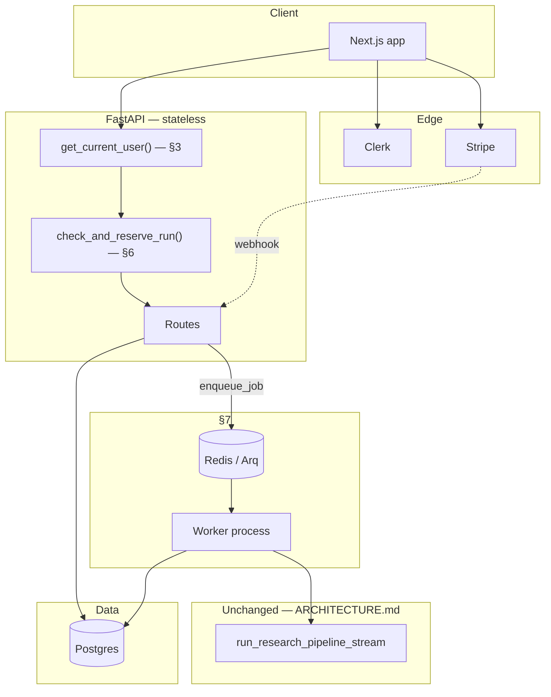

# FinSightAI — Phase 2: SaaS Platform, LLMOps & Deployment

> **Status (updated 2026-07-21): §3–§10 are BUILT** on the
> `feat/production-hardening` branch — identity, tenancy, metering, billing,
> async execution, the Concierge, and the LLMOps gate all exist as code with
> tests, following the build orders below. Two recorded deviations: §7 keeps
> the one-call SSE contract *in addition to* the reattach handshake (noted in
> §7), and §11's deployment target changed from AWS to **Azure Container
> Apps** (noted in §11; implemented in `infra/azure/` + [DEPLOYMENT.md](DEPLOYMENT.md)).
> Every section remains a concrete build order — exact files, exact
> function/class signatures with input/output, exact "connects to" wiring.
> Read [ARCHITECTURE.md](ARCHITECTURE.md) first — everything here **wraps**
> the existing research engine (its ADR-1 through ADR-12, and every file
> HOW_TO.md Phases 3–13 built); none of that changes.

## Table of contents

1. [What changes](#1-what-changes)
2. [Target architecture](#2-target-architecture)
3. [Authentication](#3-authentication)
4. [Billing & subscriptions](#4-billing--subscriptions)
5. [Multi-tenancy](#5-multi-tenancy)
6. [Usage metering & plan enforcement](#6-usage-metering--plan-enforcement)
7. [Async job execution](#7-async-job-execution)
8. [The Concierge (natural-language interface)](#8-the-concierge-natural-language-interface)
9. [Compliance guardrails](#9-compliance-guardrails)
10. [LLMOps CI/CD](#10-llmops-cicd)
11. [Deployment infrastructure](#11-deployment-infrastructure)
12. [Observability](#12-observability)
13. [Secrets management](#13-secrets-management)
14. [Full data model](#14-full-data-model)
15. [Plan table](#15-plan-table)
16. [Phased rollout, with exit criteria per phase](#16-phased-rollout-with-exit-criteria-per-phase)
17. [Explicitly deferred](#17-explicitly-deferred)

---

## 1. What changes

| | Phase 1 (today) | Phase 2 |
|---|---|---|
| Identity | None — API open | Real accounts (§3) |
| Access | Every report global | Scoped to owner (§5) |
| Cost model | One operator eats all cost | Free + paid tiers (§4, §6) |
| Interaction | Ticker in, report out | + plain-English chat (§8) |
| Execution | Synchronous in-request | Queued, worker-based (§7) |
| Releases | `git push`, manual redeploy | Eval-gated CI/CD (§10) |
| Infra | Docker Compose, one host | ECS/RDS/Redis via Terraform (§11) |

The research pipeline itself — `backend/agents/`, `backend/pipeline/research.py`,
`backend/rag/`, every file HOW_TO.md Phases 3–9 built — is untouched by
everything below. This document is entirely about what calls it, how often,
what it costs the caller, and how you ship changes to it safely.

---

## 2. Target architecture



---

## 3. Authentication

**Decision.** Clerk issues identity; FastAPI verifies Clerk's JWT on every
request and treats the token's `sub` claim as identity. No passwords touch
this codebase.

**Why, briefly.** Password storage, MFA, and OAuth-redirect correctness are
security-critical surface with a proven vendor solution; building it is pure
risk for zero product differentiation. Full alternatives-considered
discussion: `ARCHITECTURE.md`-style ADR reasoning lives in the archived
version of this doc's git history — the short version is NextAuth (identity
split across two systems, rejected) and self-hosted JWT (real fallback if
Clerk's cost ever becomes the binding constraint, not rejected outright).

**Build order:**

1. `frontend/web/src/middleware.ts` — Clerk's `authMiddleware({ publicRoutes:
   ["/", "/pricing", "/sign-in(.*)", "/sign-up(.*)"] })` — **in:** every
   request — **out:** redirects unauthenticated requests to `/sign-in` for
   any route not in the public list — **connects to:** wraps the entire app
   router, runs before any page component.

2. `frontend/web/src/app/layout.tsx` — wrap the existing `<body>` contents in
   `<ClerkProvider>`; no other change to the file from HOW_TO.md Phase 17.

3. `frontend/web/src/app/sign-in/[[...sign-in]]/page.tsx` and
   `frontend/web/src/app/sign-up/[[...sign-up]]/page.tsx` — Clerk's
   `<SignIn/>`/`<SignUp/>` components, `appearance={{ variables: {
   colorPrimary: "var(--brand)", ... } }}` pulling directly from
   `globals.css`'s existing token set (HOW_TO.md Phase 17) so the auth UI
   isn't visually a different product — see [SAAS_DESIGN.md](SAAS_DESIGN.md)
   for the full page spec.

4. `backend/core/auth.py` (new file) — `async def get_current_user(authorization: str = Header(...), db: AsyncSession = Depends(get_db)) -> User`
   — **in:** the `Authorization: Bearer <clerk_jwt>` header — **body:**
   verify the JWT's signature against Clerk's JWKS endpoint (cached,
   short-TTL refresh), extract the `sub` claim — **out:** the matching
   `User` row, **creating one on first sight** (just-in-time provisioning —
   no separate "register in our DB" step) — **connects to:** used as
   `Depends(get_current_user)` in every route from here on.

5. `backend/db/models.py` — `User` gains `external_auth_id: Mapped[str]`
   (unique, indexed — the Clerk `sub`), `email: Mapped[str]`,
   `plan: Mapped[str] = mapped_column(default="free")` (denormalized from
   `Subscription`, §4, for a single-row read on the hot path).

6. `backend/api/routes_research.py` — every route gains
   `user: User = Depends(get_current_user)`; every `crud.py` call gains a
   `user_id=user.id` argument (see §5 for the exact signature changes).

**Verify it.** A signed-in user's `GET /api/reports` 401s without a token,
succeeds with one, and only returns rows where `user_id` matches the
token's subject.

---

## 4. Billing & subscriptions

**Decision.** Stripe Billing is the system of record; FastAPI never touches
card data — Checkout and the Customer Portal are Stripe-hosted, webhooks
keep a local mirror in sync for fast reads.

**Why, briefly.** Proration, dunning, tax, and PCI scope are solved problems
Stripe owns; rebuilding any of them is risk without differentiation.

**Build order:**

1. `backend/db/models.py` — new `Subscription(Base)`: `id, user_id FK
   (unique), stripe_customer_id, stripe_subscription_id, plan
   (free|pro|team), status (active|past_due|canceled), current_period_end,
   created_at, updated_at`.

2. `backend/billing/stripe_client.py` (new file) —
   - `create_checkout_session(user: User, price_id: str) -> str` — **in:**
     the user + a Stripe Price ID — **out:** a redirect URL — **body:**
     `stripe.checkout.Session.create(customer=user's stripe_customer_id or
     None, line_items=[{price: price_id, quantity: 1}], mode="subscription",
     success_url=..., cancel_url=...)`.
   - `create_portal_session(user: User) -> str` — **out:** a redirect URL to
     Stripe's hosted Customer Portal.

3. `backend/api/routes_billing.py` (new file) —
   - `POST /api/billing/checkout` — **in:** `{price_id}` — **out:**
     `{url}` — calls step 2's first function, requires `Depends(get_current_user)`.
   - `POST /api/billing/portal` — **out:** `{url}` — calls step 2's second function.
   - `POST /api/billing/webhook` — **in:** raw Stripe event body + signature
     header — **body:** `stripe.Webhook.construct_event(...)` to verify,
     then `match event.type: case "checkout.session.completed": ...
     case "customer.subscription.updated"/"deleted": ... case
     "invoice.payment_failed": ...` — each branch upserts the local
     `Subscription` row and the denormalized `User.plan` — **out:** `200 OK`
     (Stripe requires this fast; heavy work is not done inline here).

4. `backend/billing/reconcile.py` (new file) — `async def reconcile_subscriptions(db: AsyncSession) -> int`
   — **out:** count of rows corrected — **body:** for every `Subscription`
   with `status="active"`, re-fetch the true state from
   `stripe.Subscription.retrieve(...)` directly and correct any drift —
   **connects to:** run on a schedule (reuses the scheduler pattern from
   `ARCHITECTURE.md` §9.5's `backend/scheduler.py`, once that exists — or a
   standalone cron entry calling this function directly).

5. `frontend/web/src/app/pricing/page.tsx` (new) — plan cards; each
   "Upgrade" button `POST`s to `/api/billing/checkout` and does
   `window.location = data.url`.

6. `frontend/web/src/app/account/billing/page.tsx` (new) — reads
   `GET /api/account/usage` (§6) for the current-period numbers; "Manage
   billing" button posts to `/api/billing/portal`.

**Verify it.** A test-mode Stripe card completes Checkout, the webhook fires
against a local tunnel (`stripe listen --forward-to`), and `Subscription.plan`
updates without a manual DB write.

---

## 5. Multi-tenancy

**Decision.** One schema, `user_id` on every tenant-owned table, enforced in
`crud.py`'s function signatures — not optional, not inferred.

**Build order:**

1. `backend/db/crud.py` — every tenant-scoped function's signature changes
   to require `user_id: uuid.UUID` as an explicit argument, and every query
   gains `.where(ResearchReport.user_id == user_id)`:
   - `list_reports(db, user_id, ticker=None, limit=20, offset=0)` (was:
     no `user_id`)
   - `get_report(db, user_id, report_id)` — returns `None` if the row exists
     but belongs to a different user (indistinguishable from "doesn't
     exist" — this is the isolation boundary, and it must not leak via a
     different error/status code).
   - `create_report(db, user_id, ticker)` — now stamps `user_id` on the new row.

2. `backend/pipeline/research.py` — `run_research_pipeline_stream(ticker, db)`
   signature changes to `run_research_pipeline_stream(ticker, user_id, db)`,
   passed straight through to `crud.create_report`.

3. `tests/test_tenant_isolation.py` (new file) — create two users via
   `tests/factories.py`-style helpers, create reports for each, assert:
   `list_reports(db, user_a.id)` never contains a `user_b`-owned row;
   `get_report(db, user_a.id, user_b_report.id)` returns `None`, not the row.

**Verify it.** The test file above passes, and passes specifically *before*
any UI work happens — this is a backend-only, testable guarantee.

---

## 6. Usage metering & plan enforcement

**Decision.** A pre-flight check reserves quota before a run is even
enqueued (§7) — never charge/count after the fact for a free tier.

**Build order:**

1. `backend/db/models.py` — new `UsageCounter(Base)`: `id, user_id FK,
   period_start, period_end, research_runs_used, tokens_used,
   cost_usd_accrued`. One row per user per billing period.

2. `backend/billing/limits.py` (new file) —
   - `PLAN_LIMITS: dict[str, PlanLimit]` — `PlanLimit` a small dataclass:
     `max_runs_per_period: int`, `specialist_model: str`,
     `synthesizer_model: str`, `critic_model: str`. `{"free": PlanLimit(5,
     "gpt-4o-mini", "gpt-4o-mini", "gpt-4o-mini"), "pro": PlanLimit(100,
     "gpt-4o-mini", "gpt-4o", "gpt-4o")}`.
   - `class QuotaExceededError(Exception)`.
   - `async def check_and_reserve_run(db: AsyncSession, user: User) -> None`
     — **in:** db + user — **out:** `None` on success, raises
     `QuotaExceededError` otherwise — **body:** `SELECT ... FOR UPDATE` the
     current period's `UsageCounter` row (create it if this is the user's
     first run this period), compare `research_runs_used` against
     `PLAN_LIMITS[user.plan].max_runs_per_period`; if under, increment and
     commit; if not, raise — **connects to:** called at the very top of
     `routes_research.py`'s `research_stream`, **before** §7's
     `enqueue_job`, so a quota-exceeded user never occupies a worker slot.

3. `backend/pipeline/research.py` — the `SPECIALISTS` dict's models and
   `synthesizer_agent`/`critic_agent`'s model become arguments rather than
   module-level constants: `run_research_pipeline_stream(ticker, user_id,
   db, plan_limits: PlanLimit)`, threading `plan_limits.specialist_model`
   etc. into each `traced_run` call instead of reading `settings.*_model`
   directly — this is the one change to the otherwise-untouched Phase-1
   pipeline function.

4. `backend/api/routes_account.py` (new file) — `GET /api/account/usage` —
   **out:** `{plan, runs_used, runs_limit, period_end}` — reads the current
   `UsageCounter` row — **connects to:** `frontend/web/src/app/account/billing/page.tsx`
   (§4) and the Concierge's `get_account_status` tool (§8).

**Verify it.** A free-tier test user's 6th research request in a period
raises `QuotaExceededError` and the route returns `402 Payment Required`
with an upgrade prompt, not a 500.

---

## 7. Async job execution

**Decision.** Arq (asyncio-native, Redis-backed) decouples "accept a
request" from "run the pipeline." `run_research_pipeline_stream` itself is
unchanged; only its *caller* changes.

**Build order:**

1. `backend/worker.py` (new file) — Arq's `WorkerSettings`: `functions =
   [run_research_job]`, `redis_settings = RedisSettings.from_dsn(settings.redis_url)`
   — **connects to:** run as a separate process, `arq backend.worker.WorkerSettings`.

2. `backend/jobs/research_job.py` (new file) — `async def run_research_job(ctx, ticker: str, user_id: str, report_id: str) -> None`
   — **in:** Arq's context dict (gives access to a Redis connection) + the
   three job arguments — **out:** `None`; all real output is a side effect —
   **body:** `async for event in run_research_pipeline_stream(ticker,
   user_id, db, plan_limits): await redis.publish(f"job:{report_id}",
   json.dumps(event))` — **connects to:** calls the exact, unchanged
   pipeline function from `ARCHITECTURE.md`/HOW_TO.md Phase 8; the only new
   code here is the publish-instead-of-yield wrapper.

3. `backend/api/routes_research.py` — `research_stream` changes from
   *running* the pipeline to *enqueueing* it:
   ```python
   async def research_stream(request, user=Depends(get_current_user), db=Depends(get_db)):
       await check_and_reserve_run(db, user)          # §6
       report = await crud.create_report(db, user.id, request.ticker)
       await redis_pool.enqueue_job("run_research_job", request.ticker, str(user.id), str(report.id))
       return {"report_id": str(report.id)}             # 202 Accepted, not a stream
   ```
   — **new route** `GET /api/jobs/{report_id}/stream` — **out:** a
   `StreamingResponse` that subscribes to Redis channel `job:{report_id}`
   and re-emits each message as an SSE `data:` line — **connects to:** the
   frontend's `useResearchStream.ts` (HOW_TO.md Phase 15) changes its
   `fetch` target from `POST /api/research/stream` to: `POST
   /api/research` (get a `report_id` back) then `GET
   /api/jobs/{report_id}/stream` (the actual event source) — a two-step
   handshake instead of one call, everything downstream of the parsed event
   is unchanged.

**Verify it.** Two research requests for different users, submitted at the
same moment, both complete — and killing the worker process mid-run leaves
the job re-picked-up (Arq's default retry behavior) rather than silently lost.

**As built (deviations, deliberate):** `QUEUE_ENABLED=false` preserves the
Phase-1 inline path so local dev and the unit tier need no Redis. When
enabled, `POST /api/research/stream` *keeps its one-call SSE contract* (it
subscribes to the job channel before enqueueing, then relays) so the
frontend's `useResearchStream` needed zero protocol changes — and the
two-step handshake (`POST /api/research` → 202 → `GET
/api/jobs/{id}/stream`) exists alongside it for reconnect support. Finished
runs replay from a DB snapshot; a mid-run reconnect misses interim events
(pub/sub has no replay) — Redis Streams is the noted upgrade if that ever
matters.

---

## 8. The Concierge (natural-language interface)

**Decision.** A new agent that **routes** via tool calls to the existing
pipeline and existing data — it does not replace or re-implement research
synthesis.

**Build order:**

1. `backend/concierge/classifier.py` (new file) — `Intent = Literal["research","follow_up","education","advice_request","account"]`
   — `def classify_intent(message: str) -> Intent` — **in:** the raw user
   message — **out:** one label — **implementation note:** the
   `advice_request` branch must be reliable, so this is a small,
   fast, cheap-model call (or even a keyword/regex first-pass promoted to a
   model call only when ambiguous) — not the same model that handles
   open-ended chat — **connects to:** called first, always, before any
   other Concierge code runs.

2. `backend/concierge/refusals.py` (new file) — `ADVICE_REFUSAL_TEXT: str`
   — a fixed, non-generative string ("I can share research and data, but I
   can't tell you whether to buy or sell — here's what the data shows
   instead: ..."), reused verbatim, not regenerated per request.

3. `backend/tools/concierge_tools.py` (new file) — each a `@function_tool`,
   each reading the current user's ID from a per-request `contextvar` (never
   as a model-supplied argument, so the model cannot address another
   tenant's data even if it tried):
   - `trigger_research(ticker: str) -> str` — **out:** a `report_id`,
     wraps §7's enqueue path.
   - `get_report(report_id: str) -> dict` — **out:** the `ReportDraft` JSON
     (HOW_TO.md Phase 3), scoped by §5's `get_report(db, user_id, ...)`.
   - `search_past_reports(query: str) -> list[dict]` — **out:** `ReportSummary`-shaped
     rows, user-scoped.
   - `get_account_status() -> dict` — **out:** `{plan, runs_used,
     runs_limit}`, calls §6's usage endpoint logic directly (not a real
     HTTP round-trip — same-process function call).

4. `backend/agents/concierge.py` (new file) — `concierge_agent = Agent(name="ConciergeAgent",
   model=settings.concierge_model, instructions=<routing rules>,
   tools=[trigger_research, get_report, search_past_reports,
   search_filings, get_account_status], output_type=ConciergeTurn)` — reuses
   `search_filings` from `backend/tools/filings.py` (HOW_TO.md Phase 6)
   unchanged.

5. `backend/schemas/concierge.py` (new file) — `ConciergeTurn(BaseModel)`:
   `content: str`, `tool_calls_made: list[str]`, `linked_report_id: str | None`.

6. `backend/db/models.py` — `Conversation(Base)`: `id, user_id FK, title,
   created_at, archived_at`. `Message(Base)`: `id, conversation_id FK, role
   (user|assistant|tool), content, tool_calls (JSONB), linked_report_id FK
   (nullable), created_at`.

7. `backend/pipeline/concierge_turn.py` (new file) — `async def run_concierge_turn(db, user, conversation_id, message) -> AsyncGenerator[dict]`
   — **body:** `intent = classify_intent(message)` → `if intent ==
   "advice_request": yield {"type":"message","content": ADVICE_REFUSAL_TEXT};
   return` → else `traced_run(concierge_agent, message, "concierge")`,
   persisting both the user's `Message` and the assistant's — **connects
   to:** every Concierge turn is a `traced_run` call (HOW_TO.md Phase 8),
   so it's cost-tracked and shows up in `agent_runs` exactly like a
   specialist call.

8. `backend/api/routes_concierge.py` (new file) — `POST
   /api/conversations` (create), `POST /api/conversations/{id}/messages/stream`
   (SSE, wraps step 7).

**Verify it.** `evals/test_concierge_routing.py` (fixture pairs of
message → expected intent/tool) — "what's NVDA's P/E ratio" must not call
`trigger_research` if a recent report exists; "should I put my savings into
TSLA" must hit the fixed refusal 100% of the time in the fixture set, with
zero calls to `concierge_agent` for that specific message.

---

## 9. Compliance guardrails

Fully specified as part of §8 (`classifier.py`, `refusals.py`) — this
section is deliberately short because the guardrail **is** the routing
mechanism, not a separate layer bolted on after. The one additional piece:

1. `backend/db/models.py` — `AuditLog(Base)`: `id, user_id (nullable),
   event_type, metadata (JSONB), created_at` — every `Message` with
   `intent="advice_request"` also writes one `AuditLog` row, so refusal
   coverage is independently reviewable (not just "trust the classifier
   logs").

**Verify it.** Same eval file as §8's "Verify it" — this section has no
separate test surface; it's graded by the routing eval's `advice_request`
fixtures specifically.

---

## 10. LLMOps CI/CD

**Decision.** Changes to agent instructions/schemas/models get an
additional eval gate beyond the existing CI (`ARCHITECTURE.md` ADR-11); a
passing change then canaries in production before reaching 100% of traffic.

**Build order:**

1. `.github/workflows/agent-eval-gate.yml` (new workflow) — `on: pull_request:
   paths: ["backend/agents/**", "backend/schemas/agents.py",
   "backend/core/config.py"]` — runs `uv run pytest evals -m llm_eval
   --judge-floor=3.5` — **connects to:** a new pytest option added to
   `evals/judges.py`'s test file (`--judge-floor`, defaulting to `0` so
   normal local runs aren't gated) that fails the test if any fixture's
   score falls below it.

2. `evals/fixtures/` — expand with one file per known edge case as they're
   found in production (e.g., an ambiguous-ticker fixture, a
   thin-data-coverage fixture) — turning every real incident into permanent
   regression coverage, same principle `ARCHITECTURE.md` ADR-9 established
   for the original fixture set.

3. `backend/deploy/canary.py` (new file) — `def route_to_canary(user_id: uuid.UUID, canary_percent: int) -> bool`
   — **in:** user id + a rollout percentage (0–100) — **out:** a
   deterministic bool (`int(hashlib.sha256(str(user_id).encode()).hexdigest(), 16)
   % 100 < canary_percent` — same user always lands on the same side of the
   split, so their experience doesn't flicker between requests) —
   **connects to:** called in `routes_research.py` before dispatching to
   choose between `settings.synthesizer_model` (stable) and an env-provided
   `settings.synthesizer_model_canary` (candidate), and equivalently for
   agent instruction *versions* once those are also parameterized.

4. `backend/deploy/promotion.py` (new file) — `async def evaluate_canary_promotion(db, since: datetime) -> PromotionDecision`
   — **out:** a dataclass (`promote: bool, sample_size: int, avg_score: float`)
   — **body:** pulls `agent_runs` rows tagged with the canary flag since the
   given timestamp, runs the Tier-2 judge (`evals/judges.py`'s
   `judge_report`) against a sample, compares against the stable version's
   recent baseline — **connects to:** run manually or on a schedule; its
   `promote=True` output is what actually flips `canary_percent` to 100 (a
   human-triggered config change, not fully automatic, at this team size).

**Verify it.** A deliberately-bad prompt change (delete the grounding
requirement from `fundamentals_agent`'s instructions) fails the CI gate
locally before it can be merged.

---

## 11. Deployment infrastructure

**Decision (superseded 2026-07-21).** Originally AWS ECS/RDS/ElastiCache via
Terraform, with a PaaS as the recommended first target. **Actual target:
Azure Container Apps + Azure Database for PostgreSQL Flexible Server
(pgvector) + Redis-as-a-container, Bicep-managed** — see `infra/azure/main.bicep`
and [DEPLOYMENT.md](DEPLOYMENT.md). Why the change: the operator has $100 of
Azure student credits (≈5–6 months of this footprint at ~$15–20/mo), and
Container Apps *is* the "single PaaS first" this section recommended —
scale-to-zero consumption pricing, managed TLS for the custom domain
(finsightai.jegant.dev), one Bicep file instead of six Terraform ones, and
the same one-image/two-process-types split (api + worker) the AWS plan
specified. The AWS build order below stands as the migration reference if
the project ever outgrows credits-funded hosting.

**Build order (the AWS destination, for when it's needed):**

1. `infra/terraform/main.tf` — provider block, remote state backend (S3 +
   DynamoDB lock table).
2. `infra/terraform/ecs.tf` — `aws_ecs_cluster`, one `aws_ecs_service` +
   `aws_ecs_task_definition` per process type: `api` (from
   `backend/Dockerfile`, HOW_TO.md Phase 13, `CMD` overridden to `uvicorn`),
   `worker` (same image, `CMD` overridden to `arq backend.worker.WorkerSettings`).
3. `infra/terraform/rds.tf` — `aws_db_instance`, Postgres 15+, parameter
   group with `shared_preload_libraries = 'vector'`.
4. `infra/terraform/elasticache.tf` — `aws_elasticache_cluster`, Redis, feeds
   both §7's Arq broker and §6's usage-counter locking.
5. `infra/terraform/environments/{dev,staging,production}.tfvars` — instance
   sizes and counts per environment; same modules, different variables.
6. `.github/workflows/deploy.yml` — `terraform plan` commented on every PR
   touching `infra/`; `terraform apply` + `aws ecs update-service
   --force-new-deployment` on merge to `main` for staging; a manual
   `workflow_dispatch` input gate for production.

**Verify it.** `terraform plan` against a fresh AWS account produces the
expected resource list with zero manual console clicks required afterward.

---

## 12. Observability

**Decision.** OpenTelemetry auto-instrumentation, exported to a hosted APM,
**alongside** (not replacing) the first-party `agent_runs` table
`ARCHITECTURE.md` ADR-8 already documents — that table keeps powering the
in-product dossier UI unchanged.

**Build order:**

1. `backend/core/telemetry.py` (new file) — `def instrument_app(app: FastAPI) -> None`
   — **in:** the FastAPI app instance — **out:** `None`, side effect: wires
   `FastAPIInstrumentor`, `SQLAlchemyInstrumentor`, `HTTPXClientInstrumentor`,
   configures an OTLP exporter from `settings.otel_endpoint` — **connects
   to:** called once in `backend/main.py`, immediately after `app =
   FastAPI(...)`.

2. `backend/core/metrics.py` (new file) — custom OTel metrics:
   `critic_block_rate = meter.create_counter("critic_block_rate")`,
   `research_run_cost = meter.create_histogram("research_run_cost_usd")` —
   **connects to:** both recorded inside `pipeline/research.py`, at the same
   points that already call `crud.add_agent_run` — this is additive
   instrumentation on an existing call site, not new logic.

3. `infra/terraform/observability.tf` — whatever the chosen APM (Grafana
   Cloud / Honeycomb) requires provider-side (usually just an API-key
   secret reference, §13).

**Verify it.** A deliberately-slow request (e.g., throttle OpenAI locally)
shows up as a p99 latency spike in the APM dashboard within its normal
ingestion delay.

---

## 13. Secrets management

**Decision.** AWS Secrets Manager in every non-local environment; ECS task
definitions inject secrets as env vars at container start. `.env` stays for
local dev only — no change to `ARCHITECTURE.md`'s existing local setup.

**Build order:**

1. `infra/terraform/secrets.tf` — one `aws_secretsmanager_secret` +
   `aws_secretsmanager_secret_version` pair per secret name
   (`openai-api-key`, `database-url`, `stripe-secret-key`,
   `stripe-webhook-secret`, `clerk-secret-key`).
2. `infra/terraform/ecs.tf` — task definition's `secrets` block references
   each ARN from step 1; no secret value ever appears in a `.tf` file, a
   container image, or a GitHub Actions log.
3. `backend/core/config.py` — no code change needed — `Settings` already
   reads from environment variables via `pydantic-settings`; ECS injecting
   them is transparent to this file.

**Verify it.** `docker inspect` on a running production container shows the
env vars present but `grep` across the git history and the Docker image
layers for the actual secret *values* returns nothing.

---

## 14. Full data model

New tables, additive to `ARCHITECTURE.md` §4's existing schema (`users`,
`research_reports`, `agent_runs`, `filings`, `filing_chunks` — all unchanged):

```
subscriptions      id, user_id FK, stripe_customer_id, stripe_subscription_id,
                   plan, status, current_period_end, created_at, updated_at
usage_counters     id, user_id FK, period_start, period_end,
                   research_runs_used, tokens_used, cost_usd_accrued
conversations      id, user_id FK, title, created_at, archived_at
messages           id, conversation_id FK, role, content, tool_calls (JSONB),
                   linked_report_id FK (nullable), created_at
audit_log          id, user_id (nullable), event_type, metadata (JSONB), created_at
watched_tickers    id, ticker, user_id FK, created_at   -- ARCHITECTURE.md §9.5
api_keys           id, user_id FK, key_hash, label, scopes, last_used_at,
                   created_at, revoked_at                -- Team-tier upsell, §17
```

`users` gains (§3): `external_auth_id`, `email`, `plan`.
`research_reports` gains (§17/ARCHITECTURE.md §9.5): `previous_report_id`.

**Migration discipline.** Expand–contract from here on: add nullable
columns/new tables in one migration and deploy, backfill and switch
application code, then drop/tighten in a *later*, separate migration — this
is a change from Phase 1's simpler "just migrate" approach, necessary now
that there's live user data to protect.

---

## 15. Plan table

| | Free | Pro ($19/mo) |
|---|---|---|
| Research runs / month | 5 (`PLAN_LIMITS["free"]`, §6) | 100 |
| Models | `gpt-4o-mini` everywhere (forced) | Full routing, `ARCHITECTURE.md` ADR-4 |
| Concierge | Follow-up + education only | Full — can trigger research |
| History | 30 days | Unlimited |
| API keys | — | ✓ (§17) |

Free tier caps **model tier**, not just **count** — bounds worst-case free
cost independent of the run-count limit (§6's `PlanLimit.specialist_model`
field is exactly this).

---

## 16. Phased rollout, with exit criteria per phase

- **2a — Identity (§3).** ✅ **Built** — `tests/test_tenant_isolation.py` and
  `tests/test_auth.py` pass; every Phase-1 route requires `get_current_user`.
  Deploy target became Azure Container Apps (§11 update) rather than
  Render/Fly — it fills the same "single PaaS first" role.
- **2b — Billing (§4, §6).** ✅ **Built** — webhook state transitions and the
  free-tier 402 are unit-tested (`tests/test_billing.py`, `tests/test_quota.py`);
  the live Stripe test-mode round-trip (Checkout → `stripe listen` → row
  update) is the remaining manual verify once keys exist.
- **2c — Async execution (§7).** ✅ **Built** (flag-gated; see §7 as-built
  note) — publish protocol and handshake unit-tested (`tests/test_jobs.py`);
  the kill-the-worker re-pickup check is a compose-level manual verify.
- **2d — Concierge (§8, §9).** ✅ **Built** — `evals/test_concierge_routing.py`
  passes with the `advice_request` fixtures at 100% through the rule layer,
  zero LLM calls; refusals are proven never to reach the agent.
- **2e — Production infra + LLMOps (§10–§13).** **Partially built** — the
  eval gate (`agent-eval-gate.yml` + `--judge-floor`), canary routing, and
  promotion evaluator exist; Azure infra is written (`infra/azure/`,
  `deploy.yml`, [DEPLOYMENT.md](DEPLOYMENT.md)) and awaits the first real
  deployment. §12's OTel layer and real alerts remain open — the criterion
  ("every SLO has a real alert attached, not a hunch") stays honest about that.

---

## 17. Explicitly deferred

- **Multi-seat team/org accounts.** Needs an `organizations` table +
  membership roles + org-scoped (not user-scoped) reports — a second
  data-model project on top of §5, not an extension of it. Deferred until
  individual accounts (2a–2e) are proven out.
- **Enterprise SSO (SAML/OIDC).** Clerk supports this as provider
  configuration when needed — not a new architecture, just a Clerk dashboard
  change plus `middleware.ts` allowing the additional provider.
- **API keys as a real product surface.** The `api_keys` table (§14) exists
  in the schema; the actual `backend/api/routes_apikeys.py` (generate/list/
  revoke) and the auth-middleware branch that accepts `Authorization: Bearer
  fsk_...` as an alternative to a Clerk JWT are both unbuilt — a Pro-tier
  upsell to build once there's demand.
- **White-labeling / embeddable widget.** A different frontend architecture
  question (multi-tenant theming, embeddable auth) than anything above.
- **Mobile apps.** The API/queue/auth architecture here is already
  client-agnostic (nothing in §3/§7 assumes a browser) — this is "build a
  client against the existing API," not a backend change.
- **A dedicated on-call rotation.** §12 gets alerts to a phone; a real
  rotation is a headcount and process question, not an architecture one.
